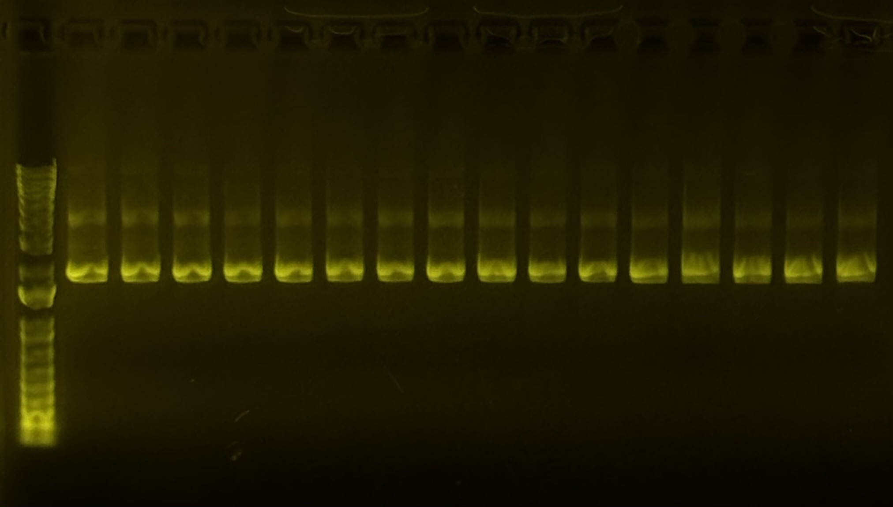
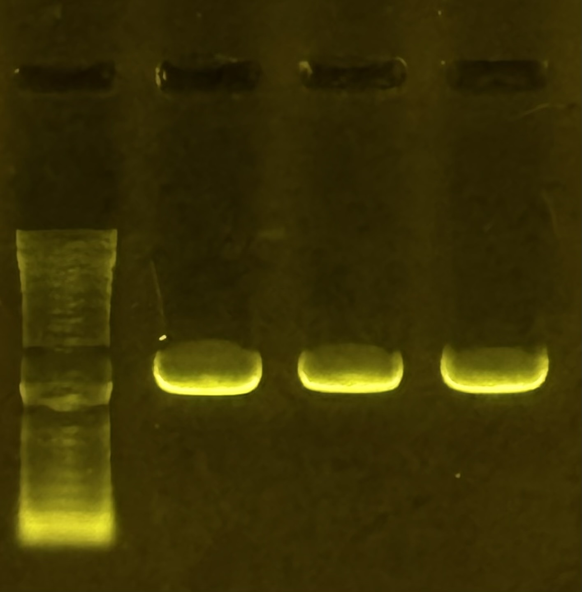

## [WB150 PCR-based Target Amplification] Vector backbone Prepration
> 본 워크플로는 sfGFP–mCherry 발현 카세트를 삽입하기 위한 벡터 백본 증폭단계로, 앞서 디자인 프라이머를 이용하여 pRSFDuet-1 백본을 PCR 기반으로 증폭하는 과정이다.  
주요 목적은 Gibson Assembly를 위한 30 bp overlap 서열을 포함한 정확한 backbone fragment 확보이다. 

## 🗂️ Related Unit Operations

- [UHW040 Desktop Liquid Handling - Manual PCR reaction mixture preparation](#uhw040-desktop-liquid-handling---manual-pcr-reaction-mixture-preparation)
- [UHW100 Thermocycling - Vector backbone PCR](#uhw100-thermocycling---vector-backbone-pcr)
- [UHW230 Nucleic Acid Fragment Analysis - Agarose Gel Electrophoresis of PCR products](#uhw230-nucleic-acid-fragment-analysis---agarose-gel-electrophoresis-of-pcr-products)
- [UHW040 Desktop Liquid Handling - DpnI reaction preparation](#uhw040-desktop-liquid-handling---dpni-reaction-preparation)
- [UHW100 Thermocycling - Template Plasmid Removal by DpnI Digestion](#uhw100-thermocycling---template-plasmid-removal-by-dpni-digestion)
- [UHW230 Nucleic Acid Fragment Analysis - Agarose Gel Electrophoresis of DpnI-Treated PCR Product](#uhw230-nucleic-acid-fragment-analysis---agarose-gel-electrophoresis-of-dpni-treated-pcr-product)

---
### [UHW040 Desktop Liquid Handling - Manual PCR reaction mixture preparation]

- **Description**: 본 PCR은 이후 sfGFP–mCherry insert와의 Gibson Assembly에 사용할 backbone fragment 확보를 목적으로 수행되었다.  

#### Meta
- Experimenter: 윤예린
- Start_date: '2025-10-29'
- End_date: '2025-10-29'

#### Input
- pRSF Plasmid DNA (provided by 김홍연 연구원)
- pRSFduet_F1/R1 Primers (10 pmol/μL)

#### Reagent
- KOD One PCR master Mix (TOYOBO, KMM-101)
- UltraPure™ DNase/RNase-Free Distilled Water (Invitrogen, Lot #2749760)

#### Consumables
- PCR tube × 16  
- Pipette tips

#### Equipment
- Pipettes (P2.5, P100)
- Microcentrifuge tube spinner

#### Method
1. 아래표와 같은 조성으로 PCR tube에 분주한다. 

| Component                 | Concentration  | Volume (μL) | Reaction Concentration |
|---------------------------|----------------|-------------|-----------------------|
| pRSF Plasmid DNA          | 50 ng/μL       | 1           | 1 ng/μL           |
| Forward Primer (pRSFduet_F1) | 10 pmol/μL  | 1.5         | 0.3 pmol/μL         |
| Reverse Primer (pRSFduet_R1) | 10 pmol/μL  | 1.5         | 0.3 pmol/μL         |
| KOD One PCR Master Mix    | 2X             | 25          | 1X                     |
| DW (DNase/RNase-free)     | -              | 21          |
| **Total Volume**          |                | **50**      |

2. 가볍게 스핀다운하여 혼합한다.

#### Output
- PCR reaction mixture (16 tubes, 50 μL each)

#### Results & Discussions
- Thermocycling 을 통해 증폭한 이후 1 % agarose gel 전기영동을 통해 PCR 증폭 결과를 확인할 예정

---

### [UHW100 Thermocycling - Vector backbone PCR]

- **Description**:  본 PCR은 이후 sfGFP–mCherry insert와의 Gibson Assembly에 사용할 backbone fragment 확보를 목적으로 수행되었다.

#### Meta
- Experimenter: 윤예린
- Start_date: '2025-10-29'
- End_date: '2025-10-29'
- duration: 'about 40 minutes'
#### Input
- PCR reaction mixture (16 tubes, 50 μL each) 

#### Reagent
- (none)

#### Consumables
- (none)

#### Equipment
- C1000 Touch Thermal Cycler (Bio-Rad) 2번

#### Method

1. Thermocycler에 PCR 튜브를 넣고, 아래의 프로그램으로 증폭을 수행한다.

| Step                 | Temperature (°C) | Time         | Cycles |
|----------------------|------------------|--------------|--------|
| Initial Denaturation | 98               | 5 minutes    | 1      |
| Denaturation         | 98               | 10 seconds   |        |
| Annealing            | 53               | 5 seconds    | 30     |
| Extension            | 68               | 10 seconds   |        |
| Final Extension      | 68               | 5 minutes    | 1      |
| Hold                 | 4                | ∞            |        |

   - Expected PCR product size: 약 1.8 kb (pRSFDuet-1 backbone fragment)

#### Output
- PCR products (16 tubes, 50 μL each)

#### Results & Discussions
- 증폭된 PCR products는 다음 단계인 전기영동을 통해 밴드 확인 후, 정제 과정을 거쳐 Gibson Assembly에 사용될 예정이다. 

---

### [UHW230 Nucleic Acid Fragment Analysis - Agarose Gel Electrophoresis of PCR products]

- **Description**: 본 실험은 증폭된 PCR products 의 크기를 확인하기 위해 아가로스 겔 전기영동을 수행하는 과정이다.

#### Meta
- Experimenter: 윤예린
- Start_date: '2025-10-29'
- End_date: '2025-10-29'

#### Input
- PCR products (16 tubes, 50 μL each)

#### Reagent
- 50× TAE Buffer (Bioneer, Lot #25030G)  
- Agarose gel(제조사 및 Lot # 기재)
- MIDORI Green (Nippon Genetics, MG04)
- 1 Kb Plus DNA Ladder (Invitrogen, Lot #3219841)
- 10X BlueJuice™ Gel Loading Buffer (Invitrogen, Lot #3236556)

#### Consumables
- Pipette tips

#### Equipment
- Pipettes
- Mupid-2plus (Advance(Mupid), AD110)
- Gel tray & combs
- UV transilluminator

#### Method
1. 미리 1 % agarose gel 을 제조하여 준비한다. (1 % agarose with MIDORI Green / TAE buffer)
2. 녹인 gel 용액을 전기영동 캐스팅 트레이에 붓고, 굳을 때까지 기다린다. (약 20분 소요)
3. gel이 굳으면 전기영동 탱크에 옮겨 담고, 1× TAE buffer로 채운다.
4. 각 PCR 튜브로부터 1 μL의 PCR product를 취하여 1 μL의 DNA Loading Dye와 혼합한다.
5. 미리 준비해둔 1% agarose gel의 각 웰에 혼합물을 순서대로 로딩한다.
6. DNA Ladder (1 kb Plus)를 함께 로딩하여 밴드 크기 확인 기준으로 사용한다.
7. 전기영동 장치에 gel을 장착하고 100 V에서 약 20분간 전기영동을 수행한다.
8. 전기영동 완료 후 UV transilluminator을 이용하여 밴드를 관찰하고, 결과 이미지를 촬영한다.

#### Output
- Agarose gel image file
- PCR products (16 tubes, 49L each)

#### Results & Discussions

- 전기영동 결과, 예상한 크기인 약 1.8 kb 부근에서 명확한 밴드가 관찰되었으며, 이는 벡터 백본의 PCR 증폭이 성공적으로 수행되었음을 시사한다.  
- 목표 밴드가 확인되었으므로, 잔존 플라스미드 템플릿 제거를 위해 DpnI 처리를 추가로 수행할 예정이다.  
- 또한, 상단부에 비특이적 밴드가 일부 관찰되어, 정확한 밴드만을 확보하기 위해 gel 정제용 전기영동을 추가로 진행하기로 결정하였다.

---

### [UHW040 Desktop Liquid Handling - DpnI reaction preparation]

- **Description**: 본 단계는 PCR 반응 후 잔존하는 template plasmid DNA를 제거하기 위해 DpnI restriction enzyme 반응 혼합물을 준비하는 과정이다.

#### Meta
- Experimenter: 윤예린
- Start_date: '2025-10-29'
- End_date: '2025-10-29'

#### Input
- PCR products (16 tubes, 49 μL each)

#### Reagent
- DpnI restriction enzyme (NEB, R0176S)

#### Consumables
- pipette tips

#### Equipment
- Pipettes (P2.5)
- Microcentrifuge tube spinner

#### Method
1. PCR product 가 담긴 각 튜브에 DpnI enzyme 을 0.5 μL 씩 첨가한다.
2. 아래 표와 같은 조성으로 DpnI 반응 혼합물을 준비한다.

    | Component              | Stock Concentration | Volume (μL) | Final Concentration |
    |------------------------|--------------------|--------------|--------------------|
    | PCR product            | –                  | 49.0         | –                  |          
    | DpnI enzyme            | 20 U/μL            | 0.5          | 0.2 U/μL          |
    | **Total Volume**       |                    | **49.5**     |                    |
3. 가볍게 스핀다운하여 혼합한다.

#### Output
- DpnI reaction mixture (16 tubes, 49.5 μL each)

#### Results & Discussions
- PCR 단계에서 사용한 template plasmid DNA의 양은 50 ng으로, 이론적으로는 DpnI 0.1 U로도 완전 절단이 가능하다.
- 그러나 PCR 반응 혼합물 내의 잔존 buffer 성분과 효소 활성 저하를 고려하여, 충분한 절단 효율 확보를 위해 DpnI 0.5 μL (20 U/μL, 최종 0.2 U/μL)을 첨가하여 template plasmid 제거를 위한 digestion 반응을 수행하였다.
  
---

### [UHW100 Thermocycling - Template Plasmid Removal by DpnI Digestion]

- **Description**:  본 단계는 PCR 반응 후 잔존하는 template plasmid DNA를 제거하기 위해 DpnI restriction enzyme 반응을 수행하는 과정이다. DpnI은 메틸화된 DNA를 특이적으로 절단하는 효소로, PCR 산물 내에 남아있는 원본 플라스미드 템플릿을 효과적으로 제거할 수 있다.

#### Meta
- Experimenter: 윤예린
- Start_date: '2025-10-29'
- End_date: '2025-10-29'
- duration: '1 hour 30 minutes'

#### Input
- DpnI reaction mixture (16 tubes, 49.5 μL each)

#### Reagent
- (none)

#### Consumables
- (none)

#### Equipment
- C1000 Touch Thermal Cycler (Bio-Rad) 2번

#### Method

1. DpnI 반응 혼합물이 담긴 각 튜브를 Thermocycler에 넣는다.
2. Thermocycler를 이용해 다음 조건으로 반응을 수행한다.  

    | Step          | Temperature (°C) | Time    |
    |----------------|------------------|---------|
    | Digestion      | 37               | 1 hr   |
    | Enzyme inactivation | 80          | 20 min  |
    | Hold           | 4                | ∞       |

3. 각 튜브의 반응액(49.5 μL)을 다음 단계인 Gel Purification용 1% agarose gel에 로딩하기 위한 준비를 진행하였다.

#### Output
- DpnI treated PCR products (16 tubes, 49.5 μL each)

#### Results & Discussions
- DpnI 처리가 완료된 PCR products는 다음 단계인 gel purification을 통해 정확한 벡터 백본 fragment를 확보하는 데 사용될 예정이다.

---

### [UHW230 Nucleic Acid Fragment Analysis - Agarose Gel Electrophoresis of DpnI-Treated PCR Product]

- **Description**: 본 단계는 DpnI 처리된 PCR 산물을 Agarose Gel Electrophoresis를 통해 분리하고, 약 1.8 kb 크기의 목표 DNA fragment를 절단하여 정제용 시료로 확보하기 위한 과정이다. 전기영동을 통해 밴드 위치를 확인한 후, 해당 밴드를 절단하여 다음 단계인 Gel purification에 사용하였다.

#### Meta
- Experimenter: 윤예린
- Start_date: '2025-10-29'
- End_date: '2025-10-29'

#### Input
- DpnI treated PCR products (16 tubes, 49.5 μL each)

#### Reagent
- 50× TAE Buffer (Bioneer, Lot #25030G)  
- Agarose gel(제조사 및 Lot # 기재)
- MIDORI Green (Nippon Genetics, MG04)
- 1 Kb Plus DNA Ladder (Invitrogen, Lot #3219841)
- 10X BlueJuice™ Gel Loading Buffer (Invitrogen, Lot #3236556)

#### Consumables
- 1.5 mL E-tube

#### Equipment
- Pipettes
- Mupid-2plus (Advance(Mupid), AD110)
- Gel tray & combs
- UV transilluminator

#### Method
1. 미리 1 % agarose gel 을 제조하여 준비한다. (1 % agarose with MIDORI Green / TAE buffer)
2. 녹인 gel 용액을 전기영동 트레이에 붓고, purification 용 comb를 끼워서 굳을 때까지 기다린다. (약 20분 소요)
3. gel이 굳으면 전기영동 탱크에 옮겨 담고, 1× TAE buffer로 채운다.
4. 각 DpnI 처리된 PCR 튜브에 5 μL의 DNA Loading Dye를 첨가하여 혼합한다.
5. 1% agarose gel (gel purification용)의 각 웰에 시료 2개씩 로딩한다. 
   - 본 실험에서는 한 well 당 넘치지 않도록 주의하며 약 100 μL씩 로딩하였다.
6. DNA Ladder (1 kb Plus)를 함께 로딩하여 밴드 크기 확인 기준으로 사용한다.  
7. 전기영동 장치에 gel을 장착하고 100 V에서 약 25분간 전기영동을 수행한다.  
8. 전기영동 완료 후 UV transilluminator을 이용하여 목표 크기 밴드를 확인한다.
9. 확인된 밴드 중 원하는 크기(≈1.8 kb)의 DNA fragment를 얻기 위해, 해당 밴드만 절단하여 1.5 mL E-tube에 넣는다. 절단한 gel 조각은 이후 DNA gel purfication 단계에서 사용한다.

#### Output
- Agarose gel 조각 (약 1.8 kb 벡터 백본 PCR product 포함) 이 담긴 E-tube 4개

#### Results & Discussions
- 전기영동 결과, 이전 결과와 동일하게 예상한 크기인 약 1.8 kb의 밴드가 명확하게 관찰되었다. 

---

### [UHW250 Nucleic Acid Purification - Vector PCR Product Gel Purification]

- **Description**: 전기영동 후 절단 된 agarose gel 조각으로부터 target DNA fragment를 정제하는 과정이다. 본 단계에서는 column-based gel purification 방식을 이용하여, 원하는 벡터 백본 PCR product를 확보한다.
  
#### Meta
- Experimenter: 윤예린
- Start_date: '2025-10-29'
- End_date: '2025-10-29'

#### Input
- Agarose gel 조각 (약 1.8 kb 벡터 백본 PCR product 포함) 이 담긴 E-tube 4개

#### Reagent
- Wizard® SV Gel and PCR Clean-Up System (Promega, A9281)  

#### Consumables
- E-tube (1.5 mL) 
- Pipette tips

#### Equipment
- Pipettes (p1000, p100)
- centrifuge (제품명 기재 필요)
- 저울 (제품명 기재 해야함)
- Heat block (Eppendorf, ThermoStat Plus)

#### Method
- gel purification은 사용한 kit의 프로토콜에 따라 진행했음. 
  ([Wizard SV Gel and PCR Clean-Up System Quick Protocol (Promega)](.resources\manuals\Wizard_SV_Gel_and_PCR_Clean-up_System_Quick_Protocol_FB072.pdf) 참고)

1. 절단한 agarose gel 조각의 무게를 측정한다.  
2. gel 조각 무게 10mg 당 10 μL의 Membrane Binding Solution을 넣는다. 
3. gel 조각과 Membrane Binding Solution이 담긴 E-tube를 Heat block에 넣어 이용해 60 °C에서 gel이 완전히 녹을 때까지 인큐베이션한다. 중간 중 튜브를 뒤집어가며 혼합해준다.
4. 완전히 녹인 gel 용액을 column에 옮겨 담고, 마이크로센트리퓨지를 이용해 1분간 원심분리한다. 원심분리 후 flow-through는 폐기한다.
5. 컬럼에 남아있는 용액을 제거하기 위해 Membrane Wash Buffer를 700 μL 넣고 다시 1 분간 원심분리한다. 원심분리 후 flow-through는 폐기한다.
6. 다시 Membrane Wash Buffer 500 μL를 넣고 1분간 원심분리한다. 원심분리 후 flow-through는 폐기한다.
7. 남아있는 wash buffer를 완전히 제거하기 위해 1 분간 추가 원심분리를 수행한다.
8. 컬럼을 새로운 1.5 mL E-tube에 옮겨 담고, 40 μL의 Elution Buffer를 컬럼 중앙에 떨어뜨린다.
9. 컬럼을 1분간 실온에서 인큐베이션한 후, 1분간 원심분리하여 정제된 DNA를 회수한다.
10. 정제된 DNA의 농도를 NanoDrop을 이용해 측정한다.

#### Output
- 정제된 vector backbone PCR product

    | | Concentration | Volume |
    |------|-----------|------|
    | Sample 1 | 297.7 ng/μL | 30 μL |
    | Sample 2 | 320.0 ng/μL | 30μL |
    | Sample 3 | 216.0 ng/μL | 30μL |

#### Results & Discussions
-  정제된 벡터 백본 PCR product는 다음 단계인 Gibson Assembly에 사용될 예정이다.
- 정제 결과를 확인하기 위해 추가 전기영동을 간략히 수행한 결과, 예상한 크기(≈1.8 kb)에 해당하는 단일 밴드만 명확히 관찰되었으며,이는 gel purification 과정이 성공적으로 수행되었음을 시사한다.

  

