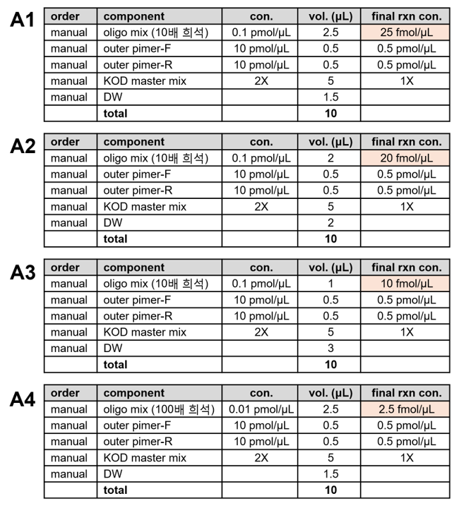
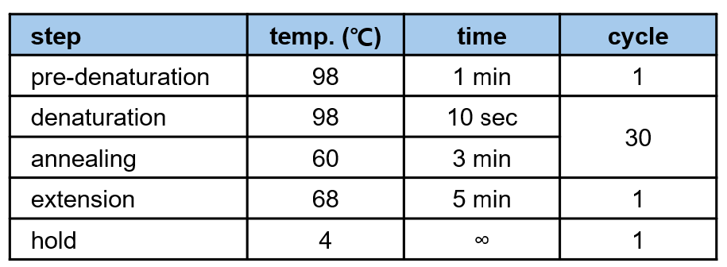
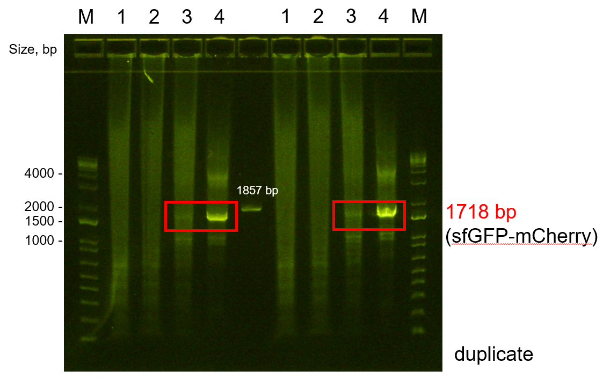
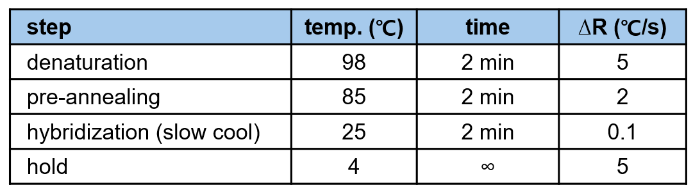
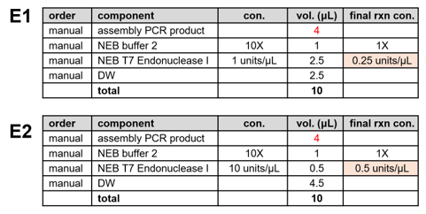
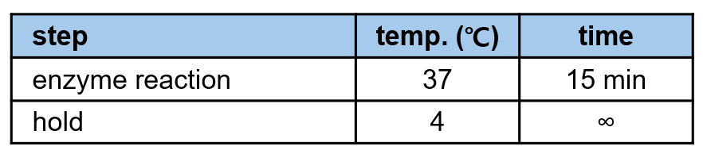
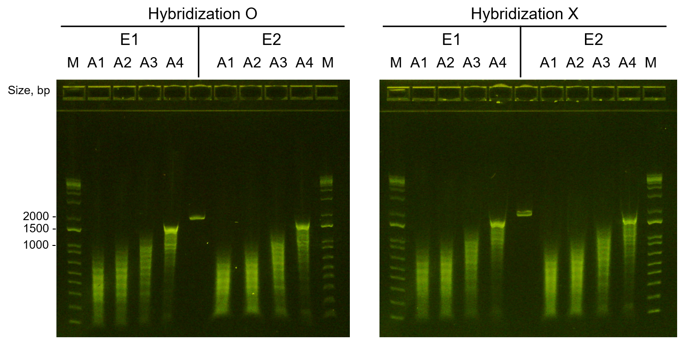
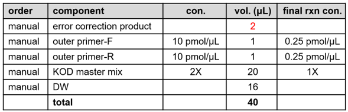
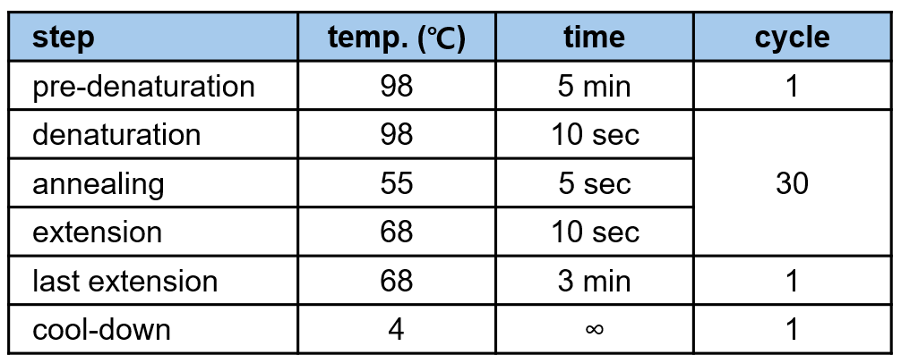
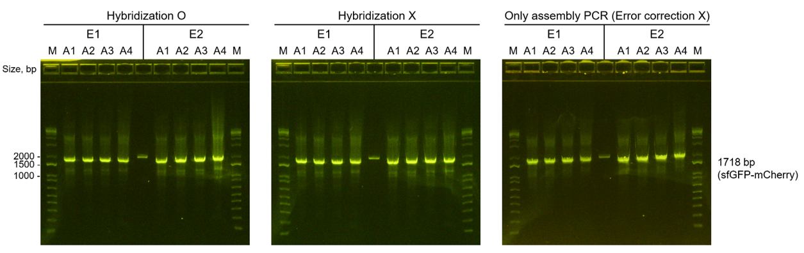

## [WB010 DNA Oligomer Assembly] sfGFP-mCheryy oliomer assembly
> 본 워크플로는 sfGFP–mCherry 유전자의 합성을 위해 수행된 oligomer pool assembly 실험 과정을 포함한다. 본 실험은 oligo pool의 resuspension부터 assembly PCR 수행, error-correction, recovery PCR 까지의 일련의 과정을 다룬다. 각 단위 작업(Unit Operation)은 상세한 실험 절차와 결과 분석을 포함하고 있다.

## 🗂️ Related Unit Operations

- [UHW040 Desktop Liquid Handling - Oligo Pool Resuspension](#uhw040-desktop-liquid-handling---oligo-pool-resuspension)
- [UHW040 Desktop Liquid Handling - Manual Assembly PCR Reaction Mixture Preparation](#uhw040-desktop-liquid-handling---manual-assembly-pcr-reaction-mixture-preparation)
- [UHW130 Sealing - Assembly PCR Plate Sealing & Centrifugation](#uhw130-sealing---assembly-pcr-plate-sealing--centrifugation)
- [UHW100 Thermocycling - Assembly PCR Reaction](#uhw100-thermocycling---assembly-pcr-reaction) 
- [UHW230 Nucleic Acid Fragment Analysis E-gel Electrophoresis of Assembly PCR Product](#uhw230-nucleic-acid-fragment-analysis-e-gel-electrophoresis-of-assembly-pcr-product)
- [UHW130 Sealing - PCR Plate Sealing & Centrifugation before Hybridization](#uhw130-sealing---pcr-plate-sealing--centrifugation-before-hybridization)
- [UHW100 Thermocycling - Pre-Error-Correction Hybridization Comparative Test](#uhw100-thermocycling---pre-error-correction-hybridization-comparative-test)
- [UHW040 Desktop Liquid Handling - Error-Correction Reaction Setup with T7 Endonuclease I](#uhw040-desktop-liquid-handling---error-correction-reaction-setup-with-t7-endonuclease-i)
- [UHW130 Sealing - Error-Correction Plates Sealing & Centrifugation](#uhw130-sealing---error-correction-plates-sealing--centrifugation)
- [UHW100 Thermocycling - Error-Correction Reaction – T7 Endonuclease I Incubation](#uhw100-thermocycling---error-correction-reaction--t7-endonuclease-i-incubation)
- [UHW230 Nucleic Acid Fragment Analysis E-gel Electrophoresis of Error-Corrected Assembly PCR Products](#uhw230-nucleic-acid-fragment-analysis-e-gel-electrophoresis-of-error-corrected-assembly-pcr-products)

- [UHW040 Desktop Liquid Handling - Recovery PCR Reaction Mixture Preparation](#uhw040-desktop-liquid-handling---recovery-pcr-reaction-mixture-preparation)
- [UHW130 Sealing - Recovery PCR Plate Sealing & Centrifugation](#uhw130-sealing---recovery-pcr-plate-sealing--centrifugation)
- [UHW100 Thermocycling - Recovery PCR Reaction](#uhw100-thermocycling---recovery-pcr-reaction)
- [UHW230 Nucleic Acid Fragment Analysis - E-gel Electrophoresis of Recovery PCR Products](#uhw230-nucleic-acid-fragment-analysis---e-gel-electrophoresis-of-recovery-pcr-products)

---

### [UHW040 Desktop Liquid Handling - Oligo Pool Resuspension]

- **Description**: 주문받은 oligo pool(lyophilized form)을 적절한 농도 및 부피로 resuspension 하여 downstream 실험에 사용할 수 있도록 준비하는 단계이다.

#### Meta
- Experimenter: 윤예린
- Start_date: '2025-10-29'
- End_date: '2025-10-30'

#### Input
- sfGFP-mCherry oligo pool (lyophilized form, IDT, Mfg ID: `746711415`)

#### Reagent
- TE (pH 8.0) buffer (Bioneer, Lot #23050K)

#### Consumables
- Pipette tips

#### Equipment
- Pipette (p100)
- Vortex-Genie 2 mixer (Scientific Industries)
- Thermomixer comfort (Eppendorf)

#### Method
1. Lyophilized oligo pool tube를 열고, TE buffer를 50 μL 첨가한다.
2. Vortex로 충분히 섞은 뒤, 상온에서 Thermomixer 에서 2시간 shaking하며 용해한다. (온도: 25 °C, 속도: 800 rpm)
3. 용해 후 시료를 냉장(4 °C)에서 overnight 보관한다. 
   - Storage: 4 °C (short-term), –20 °C (long-term)

#### Output
- Resuspended oligo pool (50 μL, 1 pmol/μL) 

#### Results & Discussions
- oligo pool resuspension 완료했으며, downstream oligomer assembly 실험에 희석하여 사용될 예정이다. 
  

---

### [UHW040 Desktop Liquid Handling - Manual Assembly PCR Reaction Mixture Preparation]

- **Description**: Assembly PCR 반응에서 oligo pool의 농도별 반응 효율을 비교하기 위해 4가지 조건(A1–A4)으로 반응 혼합물을 준비하였다. 각 반응은 총 부피 10 μL로 세팅하였으며, KOD One PCR Master Mix를 사용하였다.

#### Meta
- Experimenter: 윤예린
- Start_date: '2025-10-31'
- End_date: '2025-10-31'

#### Input
- Resuspended oligo pool (1 pmol/μL)
- Outer primers (overlap-F1, overlap-R1)
  

#### Reagent
- KOD One PCR master Mix (TOYOBO, KMM-101)
- UltraPure™ DNase/RNase-Free Distilled Water (Invitrogen, Lot #2749760)

#### Consumables
- 96-well PCR plate
- Pipette tips

#### Equipment
- Pipette (p2.5, p10, p100)

#### Method

1. oligo pool stock(1 pmol/μL)을 기준으로 **0.1 pmol/μL** 및 **0.01 pmol/μL** 농도로 희석한다.  
2. Assembly PCR 반응 혼합물은 아래와 같이 oligo pool 농도에 따라 96-well PCR plate에 각각 분주한다.   
   (총 반응 부피: 10 μL)
3. 2 개의 96-well PCR plate에 각각 A1–A4 조건을 duplicate로 준비한다.

   
   
##### A1. Oligo pool 25 fmol/μL

| Order | Component | Stock conc. | Volume (μL) | Final conc. |
|--------|------------|--------------|--------------|--------------|
| 1 | Oligo mix | 0.1 pmol/μL | 2.5 | 25 fmol/μL |
| 2 | Outer primer-F | 10 pmol/μL | 0.5 | 0.5 pmol/μL |
| 3 | Outer primer-R | 10 pmol/μL | 0.5 | 0.5 pmol/μL |
| 4 | KOD One PCR Master Mix | 2× | 5 | 1× |
| 5 | DW | – | 1.5 | – |
| **Total** |  |  | **10** |  |

---

##### A2. Oligo pool 20 fmol/μL
| Order | Component | Stock conc. | Volume (μL) | Final conc. |
|--------|------------|--------------|--------------|--------------|
| 1 | Oligo mix  | 0.1 pmol/μL | 2.0 | 20 fmol/μL |
| 2 | Outer primer-F | 10 pmol/μL | 0.5 | 0.5 pmol/μL |
| 3 | Outer primer-R | 10 pmol/μL | 0.5 | 0.5 pmol/μL |
| 4 | KOD One PCR Master Mix | 2× | 5 | 1× |
| 5 | DW | – | 2.0 | – |
| **Total** |  |  | **10** |  |

---

##### A3. Oligo pool 10 fmol/μL

| Order | Component | Stock conc. | Volume (μL) | Final conc. |
|--------|------------|--------------|--------------|--------------|
| 1 | Oligo mix  | 0.1 pmol/μL | 1.0 | 10 fmol/μL |
| 2 | Outer primer-F | 10 pmol/μL | 0.5 | 0.5 pmol/μL |
| 3 | Outer primer-R | 10 pmol/μL | 0.5 | 0.5 pmol/μL |
| 4 | KOD One PCR Master Mix | 2× | 5 | 1× |
| 5 | DW | – | 3.0 | – |
| **Total** |  |  | **10** |  |

---

##### A4. Oligo pool 2.5 fmol/μL

| Order | Component | Stock conc. | Volume (μL) | Final conc. |
|--------|------------|--------------|--------------|--------------|
| 1 | Oligo mix  | 0.01 pmol/μL | 2.5 | 2.5 fmol/μL |
| 2 | Outer primer-F | 10 pmol/μL | 0.5 | 0.5 pmol/μL |
| 3 | Outer primer-R | 10 pmol/μL | 0.5 | 0.5 pmol/μL |
| 4 | KOD One PCR Master Mix | 2× | 5 | 1× |
| 5 | DW | – | 1.5 | – |
| **Total** |  |  | **10** |  |

#### Output
- Assembly PCR reaction mixtures (A1–A4, 10 μL each) 가 들어있는 96-well PCR plate 2개 

#### Results & Discussions
- Assembly PCR reaction mixtures (A1–A4, 10 μL each) 가 들어있는 96-well PCR plate 2개 준비 완료하였다.
- 다음 단계인 Assembly PCR 수행을 위해 준비된 시료를 PCR 기기로 옮길 예정이다.

---

### [UHW130 Sealing - Assembly PCR Plate Sealing & Centrifugation]

- **Description**: Assembly PCR 반응이 담긴 96-well PCR plate를 밀봉하여 증발 및 오염을 방지하고, Thermocycler에서 안정적으로 반응이 진행될 수 있도록 준비하는 단계이다. 

#### Meta
- Experimenter: 윤예린
- Start_date: '2025-10-31'
- End_date: '2025-10-31'

#### Input
- Assembly PCR reaction mixtures (A1–A4, 96-well PCR plate × 2)

#### Reagent
- (none)

#### Consumables
- sealing film 

#### Equipment
- Automated Roll Heat Sealer (formerly a4S) (AZENTA)
- Microplate Centrifuge (MP-2500) (MIIXLAB)

#### Method
1. Assembly PCR reaction mixtures가 들어있는 96-well PCR plate를 sealer 에 넣고, seal 버튼을 눌러 sealing 한다. 
2. Sealing이 완료된 PCR plate를 Microplate Centrifuge에 넣고, 짧게 원심분리하여 시료를 바닥으로 모이게 한다.

#### Output
- Sealed Assembly PCR reaction plates (2 plates)

#### Results & Discussions
- Assembly PCR reaction mixtures가 들어있는 96-well PCR plate 2개를 sealing 및 centrifugation 완료하였다.
- 다음 단계인 Assembly PCR 수행을 위해 준비된 시료를 Thermocycler로 옮길 예정이다.

---

### [UHW100 Thermocycling - Assembly PCR Reaction]

- **Description**:   Assembly PCR 반응은 정의된 온도 사이클을 반복적으로 가열 및 냉각하여 oligo pool로부터 목표 DNA fragment를 조립(assembly)하는 과정이다.  본 단계에서는 A1–A4 조건별로 준비된 reaction mixture를 Thermocycler에 장착하여 oligo 농도에 따른 증폭 효율을 비교하였다.

#### Meta
- Experimenter: 윤예린
- Start_date: '2025-10-31'
- End_date: '2025-10-31'
- Duration: 2 hours

#### Input
- Sealed Assembly PCR reaction plates (2 plates)

#### Reagent
- (None)

#### Consumables
- (None)

#### Equipment
- T-Roboot II (Biometra) - 2, 3번 

#### Method
1. T-Roboot 이 연결된 컴퓨터에서 제어 소프트웨어를 실행한다.
2. T-Roboot 2번과 3번에 각각 Oligomer Assembly 계정으로 로그인한다. (비밀번호: 0000)
3. Thermocycler lid를 열고, Sealed Assembly PCR reaction plates 를 2번 3번 기기에 각각 장착한다.
4. Thermocycler lid를 닫고, 아래의 PCR 프로그램을 설정한다
   -프로그램 이름 : `assemblyPCR1` 
   - PCR 조건 : 
    
5. 프로그램 설정이 완료되면 Start 버튼을 눌러 PCR 반응을 시작한다.
6. PCR 반응이 완료되면 Thermocycler lid를 열고, Assembly PCR reaction plates 를 꺼낸다.
   
#### Output
- Assembly PCR reaction plates after thermocycling (2 plates)

#### Results & Discussions
- oligo pool 디자인 시 overlap 부위의 Tm 값과 KOD One PCR Master Mix의 특성을 고려하여, thermocycling 조건을 설정하였다.
- Assembly PCR 반응을 검증하기 위해서 E-gel 전기영동 분석을 다음 단계에서 수행할 예정이다.

---

### [UHW230 Nucleic Acid Fragment Analysis E-gel Electrophoresis of Assembly PCR Product]

- **Description**: Assembly PCR 결과물을 E-gel 장비를 이용해 전기영동함으로써 밴드의 크기와 증폭 효율을 확인하는 단계이다. 본 과정은 oligo pool 농도별(A1–A4) 반응 효율 비교 및 target DNA fragment(≈1.7 kb) 검증을 목적으로 수행되었다.

#### Meta
- Experimenter: 윤예린
- Start_date: '2025-10-31'
- End_date: '2025-10-31'
- Duration: 15 minutes

#### Input
- Assembly PCR reaction plates (A1–A4, post-thermocycling)

#### Reagent
- E-Gel™ 1 Kb DNA Ladder (Invitrogen, Lot# 01177830)
- UltraPure™ DNase/RNase-Free Distilled Water (Invitrogen, Lot #2749760)

#### Consumables
- E-Gel™ EX 1 % Agarose (Invitrogen, Lot# T020325-01)
- PCR tubes

#### Equipment
- E-Gel™ Power Snap Electrophoresis Device (Invitrogen)
- E-Gel™ Power Snap Camera System (Invitrogen)
- Pipette (p2.5, p20)

#### Method
1. E-Gel 1 Kb DNA Ladder 2 μL와 DW 18 μL를 새 PCR tube에 혼합하여 20 μL ladder 시료를 준비한다.  
2. Assembly PCR reaction plate의 sealing film을 제거한다.
3. Assembly PCR reaction plate에서 각 조건(A1–A4)의 PCR product 1 μL를 취해, DW 19 μL와 혼합하여 최종 20 μL 시료를 준비한다.  
4. E-Gel EX 1% Agarose cartridge를 **E-Gel Electrophoresis System**에 장착하고, 전원이 연결되어 있는지 확인한다.  
5. 준비된 DNA ladder 및 각 조건별 sample 20 μL를 E-Gel의 각 well에 순서대로 로딩한다.
6. 전기영동을 1-2% agarose 조건에서 10분간 수행한다.
7. 전기영동이 완료되면, E-Gel viewer 기기를 장착하고 밴드를 확인한 후, USB 메모리에 이미지 파일로 저장한다.

#### Output
- E-gel electrophoresis image of Assembly PCR products (A1–A4)
- Assembly PCR reaction plates (A1–A4, post-thermocycling)

#### Results & Discussions
  

- Assembly PCR 결과물의 전기영동 분석 결과, A3(10 fmol/μL) 및 A4(2.5 fmol/μL) 조건에서 약 1.7 kb 크기의 밴드가 관찰되었다.  
- 특히, 낮은 oligo pool 농도(A4) 조건에서 밴드 intensity가 가장 뚜렷하게 확인되어, oligo 농도가 낮을수록 조립 효율이 향상되는 경향을 보였다.  
- 관찰된 밴드의 크기는 설계된 sfGFP–mCherry 융합 유전자(예상 크기: 1718 bp) 와 일치하며, 해당 농도 조건에서 oligo pool 기반 assembly가 성공적으로 이루어졌음을 1차적으로 확인할 수 있었다. (sequencing 검증 필요)

---

### [UHW130 Sealing - PCR Plate Sealing & Centrifugation before Hybridization]

- **Description**: Assembly PCR 반응이 담긴 96-well PCR plate를 밀봉하여 증발 및 오염을 방지하고, Thermocycler에서 Hybridization 이 안정적으로 반응이 진행될 수 있도록 준비하는 단계이다.

#### Meta
- Experimenter: 윤예린
- Start_date: '2025-10-31'
- End_date: '2025-10-31'

#### Input
- Assembly PCR reaction plates (A1–A4, post-thermocycling, 1 plate)

#### Reagent
- (none)

#### Consumables
- sealing film 

#### Equipment
- Automated Roll Heat Sealer (formerly a4S) (AZENTA)
- Microplate Centrifuge (MP-2500) (MIIXLAB)

#### Method
1. Assembly PCR reaction mixtures가 들어있는 96-well PCR plate를 sealer 에 넣고, seal 버튼을 눌러 sealing 한다. 
2. Sealing이 완료된 PCR plate를 Microplate Centrifuge에 넣고, 짧게 원심분리하여 시료를 바닥으로 모이게 한다.

#### Output
- Assembly PCR reaction plates (A1–A4, post-thermocycling, 1 plate)

#### Results & Discussions
- Assembly PCR reaction mixtures가 들어있는 96-well PCR plate 1개를 sealing 및 centrifugation 완료하였다.
- 다음 단계인 Hybridization Feasibility Test 수행을 위해 준비된 시료를 Thermocycler로 옮길 예정이다.

---

### [UHW100 Thermocycling - Pre-Error-Correction Hybridization Comparative Test]

- **Description**:   본 실험은 Error-correction 반응 수행 전 **hybridization 단계를 포함할 필요성**을 검증하기 위해 진행되었다. Assembly PCR product plate 중 하나는 hybridization 프로그램을 수행하고, 나머지 plate는 별도의 hybridization 과정 없이 바로 enzyme을 처리하여 Error-correction 효율 차이를 비교 및 평가 예정 이다. 

#### Meta
- Experimenter: 윤예린
- Start_date: '2025-10-31'
- End_date: '2025-10-31'
- Duration: 10 minutes

#### Input
- Assembly PCR reaction plates (A1–A4, post-thermocycling, 1 plate)

#### Reagent
- (none)

#### Consumables
- (none)

#### Equipment
- T-Roboot II (Biometra) - 3번

#### Method
1. T-Robot 제어 소프트웨어를 실행하고, 3번 장비에 Oligomer Assembly 계정으로 로그인한다. (비밀번호: 0000)  
2. 두 개의 Assembly PCR reaction plates 중 1 plate만 hybridization을 수행한다.  
3. Thermocycler lid를 열고, 해당 plate를 3번 장비에 장착한다.  
4. Thermocycler lid를 닫고 아래의 프로그램을 불러온다.  
   - 프로그램 이름: `HYBRIDIZ_1`  
   - 프로그램 조건:  
       
5. 프로그램 설정 완료 후 Start 버튼을 눌러 반응을 시작한다.  
6. 반응 종료 후 Stop을 눌러 프로그램을 종료한 다음, lid를 열고 plate를 꺼낸다.  

#### Output
- Hybridized assembly PCR plate (1 ea)  
- Non-hybridized assembly PCR plate (1 ea)

#### Results & Discussions
- 본 테스트는 Error-correction 효율에 대한 hybridization 단계의 영향 여부를 비교하기 위한 사전 검증으로,  
  두 plate를 병렬로 처리하여 조립 효율 및 에러율 결과 차이를 평가할 예정이다.

---

### [UHW040 Desktop Liquid Handling - Error-Correction Reaction Setup with T7 Endonuclease I]

- **Description**: 본 단계에서는 Assembly PCR 산물 내 mismatch 부위를 교정하기 위해 T7 Endonuclease I를 첨가하여 Error-correction 반응 혼합물을 준비하였다. Hybridization 수행 plate와 미수행 plate 각각에 대해,  T7 Endonuclease I의 최종 농도(0.25 U/μL, 0.5 U/μL)를 달리하여 효소 농도 변화에 따른 교정 효율을 비교하고자 하였다.

#### Meta
- Experimenter: 윤예린
- Start_date: '2025-10-31'
- End_date: '2025-10-31'
- Duration: 16 minutes

#### Input
- Assembly PCR reaction plate (Hybridized / Non-hybridized)

#### Reagent
- T7 Endonuclease I (10 U/μL) (NEB, M0302S)
- 10× NEBuffer 2 (NEB)
- UltraPure™ DNase/RNase-Free Distilled Water (Invitrogen, Lot #2749760)

#### Consumables
- Pipette tips
- E-tubes

#### Equipment
- Pipette (p2.5, p10, p100)
- T-Robot II (Biometra) - 3번

#### Method
1.  T7E1 stock (10 U/μL)을 1× NEBuffer 2로 10배 희석하여 working stock (1 U/μL)을 준비한다.
2. assembly PCR reaction plate의 sealing film을 제거한다.
3. 각 well에 T7 Endonuclease I, 10× NEBuffer 2, DW를 첨가하여 최종 반응 부피 10 μL로 맞춘다.  
    - 두 가지 조건(E1, E2)을 각각 다음과 같이 세팅하였다.
       **E1. T7 Endonuclease I final conc. = 0.25 U/μL**
       **E2. T7 Endonuclease I final conc. = 0.5 U/μL**

        

#### Output
- Error-correction reaction plates (Hybridized / Non-hybridized, E1, E2 조건)

#### Results & Discussions
- Hybridization 수행 여부 및 T7 Endonuclease I 농도에 따른 Error-correction 반응 혼합물을 준비 완료하였다.
- 다음 단계인 Error-correction 반응 수행을 위해 준비된 시료를 Thermocycler로 옮길 예정이다.
  

--- 

### [UHW130 Sealing - Error-Correction plates Sealing & Centrifugation]

- **Description**: Error-Correction plate를 밀봉하여 증발 및 오염을 방지하고, Thermocycler에서 안정적으로 반응이 진행될 수 있도록 준비하는 단계이다.

#### Meta
- Experimenter: 윤예린
- Start_date: '2025-10-31'
- End_date: '2025-10-31'

#### Input
- Error-Correction reaction plates (Hybridized / Non-hybridized, E1, E2 조건)

#### Reagent
- (none)

#### Consumables
- sealing film 

#### Equipment
- Automated Roll Heat Sealer (formerly a4S) (AZENTA)
- Microplate Centrifuge (MP-2500, MIIXLAB)

#### Method
1. Error-Correction reaction mixture가 담긴 96 well PCR plate를 sealer 에 넣고, seal 버튼을 눌러 sealing 한다. 
2. Sealing이 완료된 PCR plate를 Microplate Centrifuge에 넣고, 짧게 원심분리하여 시료를 바닥으로 모이게 한다.

#### Output
- Sealed Error-Correction reaction plates (Hybridized / Non-hybridized, E1, E2 조건)

#### Results & Discussions
- Error-Correction reaction mixtures가 들어있는 96-well PCR plate 2개를 sealing 및 centrifugation 완료하였다.
- 다음 단계인 Error-Correction PCR 수행을 위해 준비된 시료를 Thermocycler로 옮길 예정이다.

---

### [UHW100 Thermocycling - Error-Correction Reaction – T7 Endonuclease I Incubation]

- **Description**: 본 단계에서는 T7 Endonuclease I를 이용하여 assembly PCR 산물 내 존재할 수 있는 mismatch 부위를 인식하고 절단함으로써, error-correction 반응을 실제로 수행하였다. Hybridization 유무 및 효소 농도(0.25 U/μL, 0.5 U/μL)에 따른 교정 효율 차이를 비교하기 위해 동일 조건에서 반응을 진행하였다.

#### Meta
- Experimenter: 윤예린
- Start_date: '2025-10-31'
- End_date: '2025-10-31'
- Duration: 36 minutes

#### Input
- Error-correction reaction mixtures (Hybridized / Non-hybridized, E1 & E2 조건)

#### Reagent
- (none)

#### Consumables
- (none)

#### Equipment
- T-Robot II (Biometra) - 2, 3번

#### Method
1. T-Robot 제어 소프트웨어를 실행하고, 2, 3번 장비에 각각 Oligomer Assembly 계정으로 로그인한다. 
2. Thermocycler lid를 열고, plate를 2, 3번 장비에 각각 장착한다.  
3. Thermocycler lid를 닫고 아래의 프로그램을 불러온다.  
   - 프로그램 이름: `T7E1-ENZYME`  
   - 프로그램 조건:  
       
4. 프로그램 설정 완료 후 Start 버튼을 눌러 반응을 시작한다.  
5. 반응 종료 후 Stop을 눌러 프로그램을 종료한 다음, lid를 열고 plate를 꺼낸다.  

#### Output
- Error-corrected assembly PCR plates (Hybridized / Non-hybridized, E1 & E2 조건)

#### Results & Discussions
- 전기영동(E-gel) 분석을 통해 Error-correction 이후 변화 양상을 밴드로 확인할 예정이다. 

---

### [UHW230 Nucleic Acid Fragment Analysis E-gel Electrophoresis of Error-Corrected Assembly PCR Products]

- **Description**: 본 단계에서는 Error-correction 반응(T7 Endonuclease I 처리) 후의 Assembly PCR 산물을 E-gel 전기영동 시스템을 이용하여 분석하였다. 본 실험의 목적은 Hybridization 수행 여부 및 T7E1 효소 농도(0.25 U/μL, 0.5 U/μL)에 따른 mismatch 절단 효율의 차이를 밴드 패턴으로 확인하기 위함이다.

#### Meta
- Experimenter: 윤예린
- Start_date: '2025-10-31'
- End_date: '2025-10-31'
- Duration: 15 minutes

#### Input
- Error-corrected assembly PCR plates (Hybridized / Non-hybridized, E1 & E2 조건)

#### Reagent
- E-Gel 1 Kb DNA Ladder (Invitrogen, Lot#01177830)
- UltraPure™ DNase/RNase-Free Distilled Water (Invitrogen, Lot #2749760)

#### Consumables
- E-gel EX 1 % Agarose (Invitrogen, Lot #T020325-01)
- PCR tubes
- Pipette tips

#### Equipment
- E-Gel Power Snap Electrophoresis Device (Invitrogen)
- E-Gel Power Snap Camera System (Invitrogen)
- Pipette (p2.5, p20)

#### Method
1. E-Gel 1 Kb DNA Ladder 2 μL와 DW 18 μL를 새 PCR tube에 혼합하여 20 μL ladder 시료를 준비한다.  
2. Error-corrected assembly PCR plates의 sealing film을 제거한다.
3. 각 조건의 PCR product 1 μL를 취해, DW 19 μL와 혼합하여 최종 20 μL 시료를 준비한다.  
4. E-Gel EX 1% Agarose cartridge를 E-Gel Electrophoresis System에 장착하고, 전원이 연결되어 있는지 확인한다.  
5. 준비된 DNA ladder 및 각 조건별 sample 20 μL를 E-Gel의 각 well에 순서대로 로딩한다.
6. E-Gel 시스템을 이용하여 1-2% agarose 조건에서 10분간 수행한다.
7. 전기영동이 완료되면, E-Gel viewer 기기를 장착하고 밴드를 확인한다.
8. USB 메모리에 이미지 파일로 저장한다.

#### Output
- E-gel electrophoresis image of Error-corrected Assembly PCR products (Hybridized / Non-hybridized, E1 & E2 조건)
- Error-corrected assembly PCR plates (Hybridized / Non-hybridized, E1 & E2 조건)

#### Results & Discussions
  

- Error-correction 반응 후 전기영동 분석 결과, Hybridization 여부에 관계없이 smear band 패턴이 관찰되었다.
- 밴드 패턴으로는 효율 차이를 명확히 구분하기 어렵기 때문에 추후 NGS 시퀀싱 분석을 통해 각 조건별 교정 효율 및 에러율 차이를 정량적으로 평가할 예정이다.
- error-correction 이전 결과 사진과 비교 시, 타겟 밴드(≈1.7 kb) 크기 이상의 밴드가 감소된 것을 확인할 수 있었다. 

### [UHW040 Desktop Liquid Handling - Recovery PCR Reaction Mixture Preparation]

- **Description**: 본 단계에서는 Error-corrected assembly PCR 산물을 주형(template)으로 하여 Recovery PCR을 수행하기 위한 반응 혼합물을 준비하였다. 각 조건별 error-corrected sample을 template으로 사용하여 동일한 primer set(overlap-F1 / overlap-R1)을 적용하고, KOD One PCR Master Mix를 사용하여 총 반응 부피 40 μL로 세팅하였다. 준비된 mixture는 이후 Thermocycler를 이용한 Recovery PCR 증폭에 사용된다.

#### Meta
- Experimenter: 윤예린
- Start_date: '2025-10-31'
- End_date: '2025-10-31'

#### Input
- Error-corrected assembly PCR product (Hybridized / Non-hybridized; E1 & E2 conditions)
- assembly PCR plate
- Primers (overlap-F1, overlap-R1, 10 pmol/μL)

#### Reagent
- KOD One PCR master Mix (TOYOBO, KMM-101)
- UltraPure™ DNase/RNase-Free Distilled Water (Invitrogen, Lot #2749760)
 

#### Consumables
- 96-well PCR plate
- Pipette tips

#### Equipment
- Pipettes (p10, p20)
- T-Robot II (Biometra) - 3번

#### Method
1. 새로운 96-well PCR plate를 준비한다.
2. 각 well에 조건별 Error-corrected assembly PCR product를 template으로 사용하여 아래와 같이 Recovery PCR 반응 혼합물이 되도록 분주한다.  
   (총 반응 부피: 40 μL)

   

3. 각 시료의 조성을 동일하며, 각 조건에 따른 plate 내 well 위치를 구분한다. (Plate Layout 참조) 

#### Output
-  Recovery PCR reaction mixtures 가 담긴 96-well PCR plate 
  
- **Plate Layout**
📊 [Plate_Layout_Concentration.xlsx](./resources/Plate_Layout_Concentration.xlsx) 참고

    | 코드 | 의미 |
    |------|------|
    | **A1** | Oligo pool 농도 25 fmol/μL |
    | **A2** | Oligo pool 농도 20 fmol/μL |
    | **A3** | Oligo pool 농도 10 fmol/μL |
    | **A4** | Oligo pool 농도 2.5 fmol/μL |
    | **HO** | Hybridization O (수행) |
    | **HX** | Hybridization X (미수행) |
    | **E1** | 0.25 U/μL (T7 Endonuclease I 농도) |
    | **E2** | 0.5 U/μL (T7 Endonuclease I 농도) |
    | **EX** | Error-correction 미수행 (control) |

#### Results & Discussions
- Recovery PCR 반응 혼합물을 준비 완료하였다.
- 다음 단계인 Recovery PCR 수행을 위해 준비된 시료를 Thermocycler로 옮길 예정이다.

---

### [UHW130 Sealing - Recovery PCR Plate Sealing & Centrifugation]

- **Description**: Recovery PCR mixture가 담긴 96-well PCR plate를 밀봉하여 증발 및 오염을 방지하고, Thermocycler에서 안정적으로 반응이 진행될 수 있도록 준비하는 단계이다. 

#### Meta
- Experimenter: 윤예린
- Start_date: '2025-10-31'
- End_date: '2025-10-31'

#### Input
- Recovery PCR reaction mixtures (96-well PCR plate)

#### Reagent
- (none)

#### Consumables
- sealing film 

#### Equipment
- Automated Roll Heat Sealer (formerly a4S) (AZENTA)
- Microplate Centrifuge (MP-2500) (MIIXLAB)  

#### Method
1. Recovery PCR mixtures가 들어있는 96-well PCR plate를 sealer 에 넣고, seal 버튼을 눌러 sealing 한다. 
2. Sealing이 완료된 PCR plate를 Microplate Centrifuge에 넣고, 짧게 원심분리하여 시료를 바닥으로 모이게 한다.

#### Output
- sealed Recovery PCR reaction mixtures (96-well PCR plate)

#### Results & Discussions
- Recovery PCR reaction mixtures가 들어있는 96-well PCR plate 1개를 sealing 및 centrifugation 완료하였다.
- 준비된 plate를 Thermocycler로 옮길 예정이다.

---

### [UHW100 Thermocycling - Recovery PCR Reaction]

- **Description**:  본 단계에서는 Error-corrected assembly PCR 산물을 주형(template)으로 하여 Recovery PCR 반응을 수행하였다. 

#### Meta
- Experimenter: 윤예린
- Start_date: '2025-10-31'
- End_date: '2025-10-31'

#### Input
- sealed Recovery PCR reaction mixtures (96-well PCR plate)

#### Reagent
- (none)

#### Consumables
- (none)

#### Equipment
- T-Robot II (Biometra) - 3번

#### Method
1. T-Robot 제어 소프트웨어를 실행하고, 3번 장비에 Oligomer Assembly 계정으로 로그인한다. (비밀번호: 0000)  
2. Thermocycler lid를 열고, 해당 plate를 3번 장비에 장착한다.  
3. Thermocycler lid를 닫고 아래의 프로그램을 불러온다.  
   - 프로그램 이름: `RECOVERYPCR1`  
   - 프로그램 조건:  
       
4. 프로그램 설정 완료 후 Start 버튼을 눌러 반응을 시작한다.  
5. 반응 종료 후 Stop을 눌러 프로그램을 종료한 다음, lid를 열고 plate를 꺼낸다.  

#### Output
- Recovery PCR reaction plate (96-well PCR plate)

#### Results & Discussions
- Recovery PCR 반응을 성공적으로 수행하였다.
- 이후 전기영동 분석을 통해 Recovery PCR 산물의 증폭 효율을 평가할 예정이다.

---

### [UHW230 Nucleic Acid Fragment Analysis - E-gel Electrophoresis of Recovery PCR Products]

- **Description**: 본 단계에서는 Recovery PCR 산물을 E-gel 전기영동 시스템을 이용하여 분석하였다.

#### Meta
- Experimenter: 윤예린
- Start_date: '2025-10-31'
- End_date: '2025-10-31'

#### Input
- Recovery PCR plates (96-well PCR plate)

#### Reagent
- E-Gel 1 Kb DNA Ladder (Invitrogen, Lot # 01177830)
- UltraPure™ DNase/RNase-Free Distilled Water (Invitrogen, Lot #2749760)

#### Consumables
- E-gel EX 1 % Agarose (Invitrogen, Lot #T020325-01)
- PCR tubes
- Pipette tips

#### Equipment
- E-Gel Power Snap Electrophoresis Device (Invitrogen)
- E-Gel Power Snap Camera System (Invitrogen)
- Pipette (p2.5, p20)

#### Method
1. E-Gel 1 Kb DNA Ladder 2 μL와 DW 18 μL를 새 PCR tube에 혼합하여 20 μL ladder 시료를 준비한다.  
2. Recovery PCR plates의 sealing film을 제거한다.
3. 각 조건의 PCR product 1 μL를 취해, DW 19 μL와 혼합하여 최종 20 μL 시료를 준비한다.  
4. E-Gel EX 1% Agarose cartridge를 E-Gel Electrophoresis System에 장착하고, 전원이 연결되어 있는지 확인한다.  
5. 준비된 DNA ladder 및 각 조건별 sample 20 μL를 E-Gel의 각 well에 순서대로 로딩한다.
6. E-Gel 시스템을 이용하여 1-2% agarose 조건에서 10분간 수행한다.
7. 전기영동이 완료되면, E-Gel viewer 기기를 장착하고 밴드를 확인한다.
8. USB 메모리에 이미지 파일로 저장한다.

#### Output
- Recovery PCR plates (96-well PCR plate)
- E-gel electrophoresis image of Recovery PCR products

#### Results & Discussions
  

- Recovery PCR product의 전기영동 분석 결과, 모든 조건에서 약 1.7 kb 크기의 뚜렷한 밴드가 관찰되었다. 설계된 sfGFP–mCherry 융합 유전자(예상 크기: 1718 bp)가 조립된 게 1차적으로 확인 되었다. 
- 그러나 타깃 밴드 외에도, 유사한 위치에 강도가 약한 추가 밴드들이 관찰되었다. 이는 assembly 과정에서 비특이적 결합 또는 불완전한 조립으로 인한 부산물로 추정된다.
- 정확한 각 조건별 조립 정확도 및 에러율은 향후 NGS 시퀀싱 분석을 통해 정량적 정성적으로 평가할 예정이다.
- 본 단계에서 확보된 Recovery PCR product는 정제 후, downstream cloning (Gibson Assembly) 실험에 insert DNA fragment으로 사용될 계획이다. 

