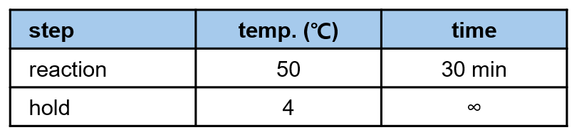

## [WB030 DNA Assembly] Gibson assembly 
> 본 워크플로는 Oligomer Assembly 과정에서 정제된 DNA 산물을 이용해 Gibson Assembly 반응을 수행하는 것을 목표로 한다.
> Gibson Assembly를 수행하기 위해 필요한 Insert와 Vector의 농도 및 부피를 python 스크립트를 활용해 계산하였으며, 이를 바탕으로 Gibson Assembly 반응 혼합물을 수동으로 준비하고 반응을 진행하였다. 

## 🗂️ Related Unit Operations
- [USW340 Computation - Gibson assembly mix calculation](#usw340-computation-gibson-assembly-mix-calculation)
- [UHW010 Liquid Handling - Gibson assembly reaction mixture 분주](#uhw010-liquid-handling-gibson-assembly-reaction-mixture-분주)
- [UHW180 Incubation - Gibson assembly reaction](#uhw180-incubation-gibson-assembly-reaction)

---

### [USW340 Computation] Gibson assembly mix calculation

- **Description**: 본 단계에서는 Gibson Assembly 반응을 위해 필요한 Insert와 Vector의 농도 및 부피를 계산하였다. 이를 위해 Python 스크립트를 활용하여 각 시료의 DNA 농도와 요구되는 molar ratio를 기반으로 최적의 혼합 비율을 산출하였다. 계산된 결과는 이후 Gibson Assembly 반응 준비에 활용되었다.

#### Meta
- Experimenter: 윤예린
- Start_date: '2025-11-06'
- End_date: '2025-11-06'

#### Input
- DNA concentration data (from NanoDrop measurements)
    [251106_input.xlsx](./resources/gibson_assembly/251106_input.xlsx)
- gibson_mix_calculation script 
    [gibson_mix_calculator_v1.py](./resources/gibson_assembly/gibson_mix_calculator_v1.py)
    [gibson_mix_calculator_v1.ipynb](./resources/gibson_assembly/gibson_mix_calculator_v1.ipynb)

#### Reagent
- (None)

#### Consumables
- (None)

#### Equipment
- Cpmputer

#### Method
1. Python 스크립트 [gibson_mix_calculation_v1.py](./resources/gibson_assembly/gibson_mix_calculation_v1.py) 또는 Jupyter Notebook [gibson_mix_calculation_v1.ipynb](./resources/gibson_assembly/gibson_mix_calculation_v1.ipynb)을 실행한다.
2. 안내에 따라 아래 파라미터를 순서대로 입력한다.
   - **입력 파일 경로**:  
     - Windows 파일 탐색기에서 입력 파일을 선택한 뒤 `Ctrl + Shift + C`로 **전체 경로를 복사**하여 입력 창에 붙여넣기 한다.
   - **출력 파일 이름**: `251106_results.xlsx`
   - **Vector 길이 (bp)**: `1857`
   - **Vector 농도 (ng/µL)**: `100`
   - **Total DNA volume (µL)**: `5`
   - **Insert : Vector molar ratio**: `3`
   - **피펫 반올림 단위 (µL)**: `0.1`

#### Output
- [251106_results.xlsx](./resources/gibson_assembly/251106_results.xlsx)

#### Results & Discussions
- Gibson Assembly 반응 준비를 위해 Insert와 Vector의 농도 및 필요 부피를 자동 계산하였다.
- 계산 결과는 [`251106_results.xlsx`](./resources/gibson_assembly/251106_results.xlsx)에 저장되었으며, 이후 Gibson Assembly 반응 혼합물 준비 시 활용될 예정이다.
- 본 실험에서는 계산된 값을 기반으로 Gibson Assembly 반응 혼합물을 수동(manual)으로 분주할 계획이다.
- 자동화 분주(Echo 525, Janus, OT-2 등)에 직접 활용하기 위해서는 리퀴드 핸들러별 요구 형식(plate layout, source/destination mapping, 최소 분주량 등)을 반영한 추가 기능 개발이 필요하다.
- 향후 스크립트 확장 방향으로는 자동화 장비에서 바로 사용 가능한 **mapping file 생성 기능** 또는 **장비별 프로토콜 자동 생성 기능**을 포함하는 것을 목표로 한다.

---

### [UHW010 Liquid Handling] Gibson assembly reaction mixture 분주

- **Description**: 본 단계에서는 Gibson Assembly 반응을 위해 계산된 Insert와 Vector의 농도 및 부피를 바탕으로 반응 혼합물을 수동으로 분주하였다.

#### Meta
- Experimenter: 윤예린
- Start_date: '2025-11-13'
- End_date: '2025-11-13'

#### Input
- **Linearized vector DNA**  
  - pRSF backbone  
  - Working concentration: 100 ng/µL (diluted)

- **Insert DNA samples**  
  - Oligomer Assembly 후 purification을 완료한 샘플  
  - 48 samples (A1–H6) in 96-well PCR plate

- **Gibson Assembly reaction mix calculation results**  
  - 분주해야 할 Insert 및 Vector 부피가 포함된 계산 파일  
  - [251106_results.xlsx](./resources/gibson_assembly/251106_results.xlsx)

#### Reagent
- Gibson Assembly Master Mix (NEB, M5510AA, Lot #10265621)

#### Consumables
- 96-well PCR plate (Biorad)
- Tips
- Sealing film

#### Equipment
- Pipettes
- Automated Roll Heat Sealer (formerly a4S) (AZENTA)
- Microplate Centrifuge (MP-2500) (MIIXLAB) 

#### Method
1. [251106_results.xlsx](./resources/gibson_assembly/251106_results.xlsx) 파일을 열어 각 시료별로 필요한 Insert 및 Vector DNA의 분주 부피를 확인한다.

2. 96-well PCR plate에 각 시료별 Gibson Assembly 반응 혼합물을 다음과 같이 준비한다:
   - **Gibson Assembly Master Mix**: 5 µL  
   - **Insert DNA**: 계산된 부피  
   - **Vector DNA**: 계산된 부피  
   - **Total reaction volume**: 10 µL

3. 모든 시료에 대해 분주가 완료되면, plate를 마이크로플레이트 원심분리기에 넣고 가볍게 스핀다운하여 반응액을 well 바닥으로 모은다.

4. 원심분리 후, plate sealer에 넣고 sealing film을 부착하여 밀봉한다. 

#### Output
- Gibson Assembly reaction mixtures (96-well PCR plate, 48 samples)

#### Results & Discussions
- Gibson Assembly 반응 혼합물을 준비하였다.
- 이후 단계에서 Gibson Assembly 반응을 진행할 예정이다.
- 사용된 insert DNA 에 purification 과정에서 소량의 magnetic bead가 남아있어, Gibson Assembly reaction mixture에도 일부 bead가 포함되었음. 그래서 후속 실험에서 영향이 있는지 확인할 예정이다.

---

### [UHW180 Incubation] Gibson assembly reaction

- **Description**: 본 단계에서는 준비된 Gibson Assembly 반응 혼합물을 이용해 Gibson Assembly 반응을 수행하였다. 반응은 NEB에서 권장하는 조건에 따라 50°C에서 30 분간 진행되었다.

#### Meta
- Experimenter: 윤예린
- Start_date: '2025-11-13'
- End_date: '2025-11-13'
- duration: 35 min

#### Input
- Gibson Assembly reaction mixtures (96-well PCR plate, 48 samples)

#### Reagent
- (None)

#### Consumables
- (None)

#### Equipment
- T-Roboot II (Biometra) - 3번

#### Method
#### Method
1. Gibson Assembly 반응 혼합물이 담긴 96-well PCR plate를 Biometra TRobot II 장비에 장착한다.

2. 장비에서 아래 설정으로 프로그램을 불러와 반응 조건을 설정한다:
   - **Program**: `GIBSON1`
   - **Temperature**: 50 °C  
   - **Incubation time**: 30 min  

   

3. `start` 버튼을 눌러 프로그램을 시작하여 반응을 진행한다. 반응이 완료될 때까지 기다린다.

4. 반응 종료 후, `stop` 버튼을 눌러 프로그램을 정지시키고 `open` 버튼을 눌러 lid를 열고 plate를 꺼낸 뒤 다음 단계로 진행한다.

#### Output
- Gibson Assembled DNA samples (96-well PCR plate, 48 samples)

#### Results & Discussions
- Gibson Assembly 반응을 수행하였음.
- 후속 단계에서 조립된 DNA 샘플을 이용해 형질전환을 진행할 예정이다.
- G2,F2,A3,B4,C4,G4,H4,A5,B5,C5,F5,G5,H5,A6,B6,C6,D6,F6,G6,H6 well에서 육안으로 확인될 정도의 magnetic bead 잔여물이 관찰되었음. transformation 효율에 미치는 영향을 확인할 예정이다.

