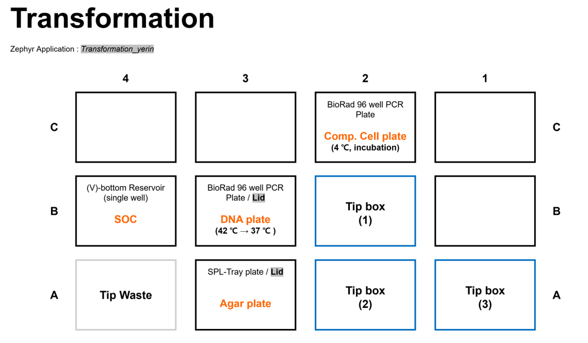
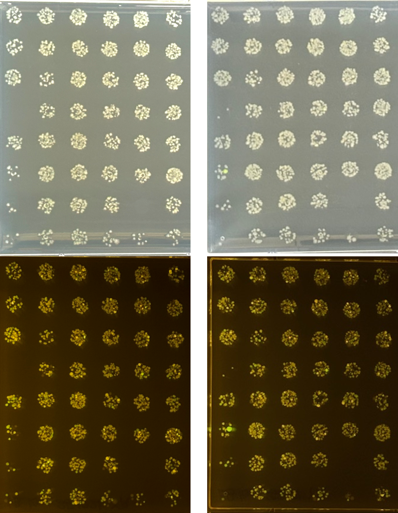

## [WB120 Biology-mediated DNA Transfers] Transformation
> 본 워크플로는 Gibson Assembly를 통해 조립된 sfGFP-mCherry 플라스미드를 대장균 세포에 형질전환하는 것을 목표로 한다. 형질전환된 세포는 선택 배지에서 선별 및 배양하여, 성공적인 유전자 도입 여부를 확인한다.

## 🗂️ Related Unit Operations

---

### [UHW020 96 Channel Liquid Handling] Automated Transformation using Zephyr 

- **Description**: Zephyr liquid handler를 이용해 대장균 화학적 형질전환을 수행하였다. Gibson Assembly 반응 산물을 competent cell에 첨가하고, heat shock 과정을 통해 DNA를 세포 내로 도입하였다. 이후 회복 배지에서 세포를 회복시킨 후, 선택 배지에 도말하여 형질전환된 콜로니를 선별하였다.

#### Meta
- Experimenter: 윤예린
- Start_date: '2025-11-13'
- End_date: '2025-11-13'

#### Input
- Gibson Assembly reaction mixture (from previous step, 96-well plate, 48 samples)

#### Reagent
- SOC medium 25 mL
- LB + Kanamycin agar square plates * 2 
- Competent E. coli DH5α cells (30 µL per well) in Bio-Rad 96-well PCR plate * 1

#### Consumables
- V-bottom single well reservoir (for SOC recovery) * 1
- universal lid for square plates * 2
- Zephyr Tip Box (96 tips) * 2  
- Ice bucket with ice

#### Equipment
- Zephyr Liquid Handler

#### Method
1. Zephyr 기기 전원, 온도 조절 장치, PC 전원을 켠다. 
2. 바탕화면의 Maestro 아이콘을 클릭하여 Zephyr 제어 소프트웨어를 실행한다.
3. 기기와 소프트웨어 연결이 완료되는 동안, Competent cell 이 담긴 96-well plate를 얼음 위에 녹인다. 
4. 소프트웨어 연결이 완료되면, 상단의 [Device Control] 아이콘을 클릭하고 `Init System` 을 클릭하여 기기를 initialize 한다.
5. Initialization이 완료되면, [ThermolLocator1], [ThermolLocator2] 탭으로 이동하여, 각 탭에서 `Temp On/Off` 버튼을 클릭하여 Turn On 에 체크하여 상태를 True로 변경한다. 
6. 이후 `Set Temp` 버튼을 클릭하여 각각 4°C로 온도를 설정한다. 
   - ThermolLocator1: 4°C (B3 위치)
   - ThermolLocator2: 4°C (C2 위치)
7. 실제 온도가 설정온도에 도달하면, 아래 사진과 동일한 구성으로 plates 및 tips 을 Zephyr deck에 장착한다.
   
   

   - 모든 plates의 위치가 올바른지 기기 정면과 옆면에서 모두 확인한다.
   - `Lid` 가 표기된 plate에는 universal lid를 덮어 준비한다. 
  
8. 다음 경로로 프로토콜을 불러온다.
`[File] → [Open Application] → [Transformation] → Transformation_yerin`

9. 초록색 ▶️ 버튼을 클릭하여 프로토콜을 시작한다.
10. 첫 번째 단계에서 Lubrication step이 포함되어 있다.
    - User Message에 "Place Lubricator at C3!!" 라는 메시지가 뜨면, Zyphyr 기기 C3 위치에 Lubricator 를 뚜껑을 열고 올려놓는다.
    - Lubrication step이 완료되면 lubricator를 제거하고, `OK` 버튼을 클릭하여 다음 단계로 진행한다.
11. "Pleace enter the number of columns to process" 창이 뜨면, 형질전환할 sample 수에 맞게 column 수를 입력한다.
12. 이후 tip을 가져가면서 프로토콜에 따라 형질전환이 진행된다.
13. 모든 단계가 완료되면, A3 위치에 spotting 된 agar plate를 꺼내어 말린다.

> 추가로 agar plate spotting이 필요한 경우, 다음 단계를 진행한다.
14. `[File] → [Open Application] → [Transformation] → Transformation_yerin_2` 프로토콜을 새로 불러온다.
15. 새로운 agar plate를 준비하여, universal lid를 덮고 A3 위치에 장착한다. 
16. Comp. cell 위치는 마지막으로 마무리된 위치인 B3 에 그대로 위치 시킨다.
17. 프로토콜을 열고 화면 오른쪽의 `Ingormation Window` 창에서 `Methods 탭`에서 `Spotting2` 단계를 더블 클릭한 후 해당 단계를 실행한다. 
18. 프로토콜이 완료되면 모든 plates를 꺼내고, 사용한 tip rack 제거 후 폐기하고, tip box는 보관한다.  
19. spotting 된 agar plate는 완전히 말린뒤, 37°C incubator에 넣어 overnight 배양한다.

#### Output
- Transformed E. coli cells on LB + Kanamycin agar plates (2 plates, 48 samples)

#### Results & Discussions
- 37 °C에서 overnight 배양 후, 형질전환된 콜로니가 선택 배지에서 성공적으로 자라는 것을 확인하였다.
- spotting 조건이 과도하게 농축되어 대부분의 spot에서 colony가 과밀하게 형성되었고, 단일 colony isolation은 어려운 상태였다.

- 다음 실험에서는 spotting volume 및 농도를 조절하여 단일 colony 확보하기 위해 개선 필요하다.

