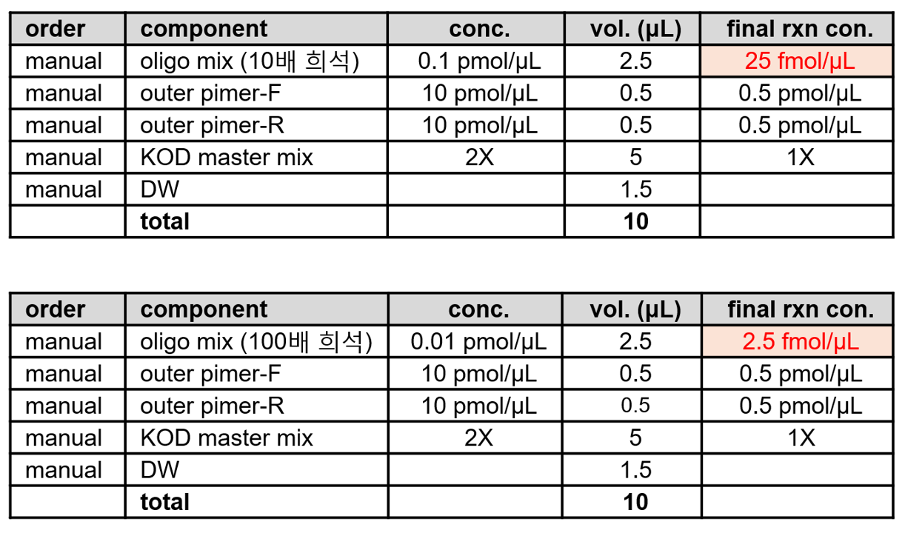
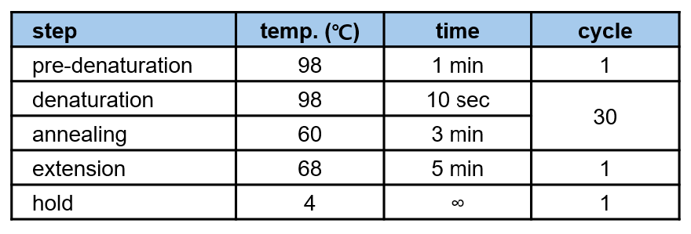
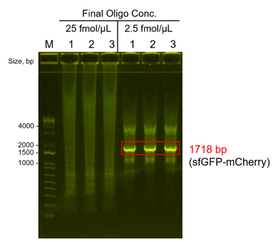
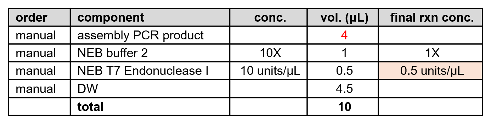
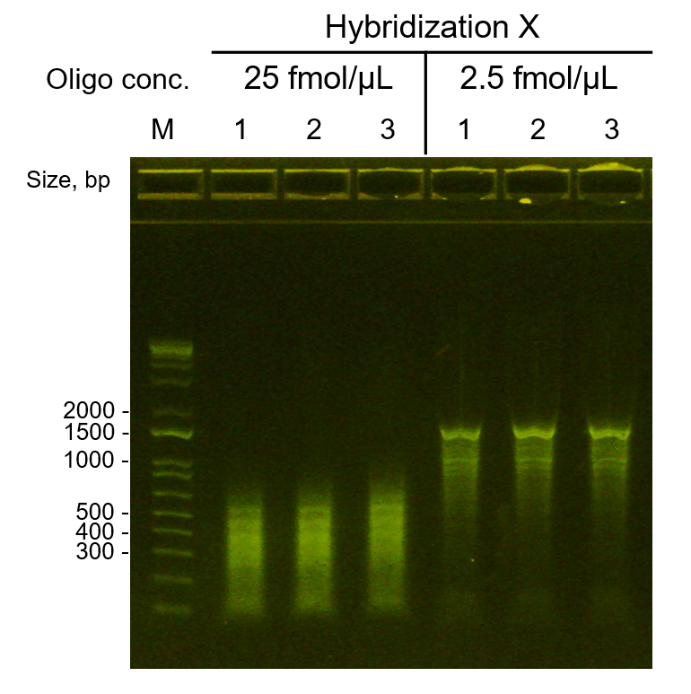
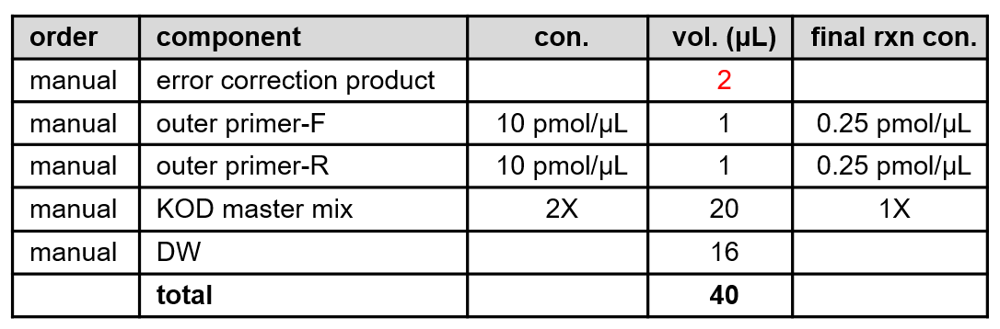
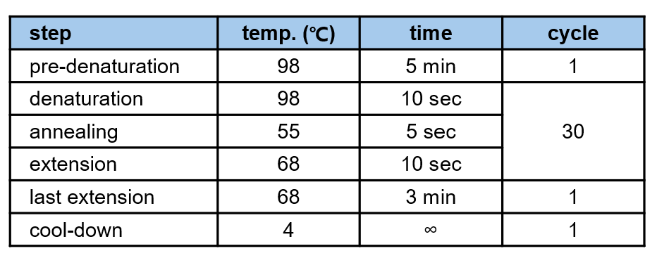
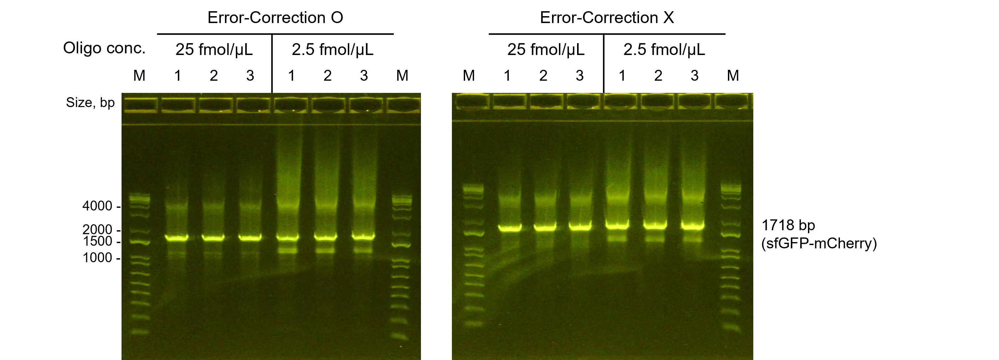

## [WB010 DNA Oligomer Assembly] sfGFP-mCherry oligomer assembly test
> 본 워크플로는 oligo pool을 이용해 약 1.7 kb 크기의 sfGFP–mCherry DNA cassette를 조립하는 과정으로, 조립 정확도에 영향을 주는 핵심 변수를 명확히 평가하기 위해 실험 조건을 최소화한 형태로 설계되었다.  
>
> 이번 실험에서는 조립 정확성과 재현성을 높이기 위해 아래 변수만을 집중적으로 검증한다.  
> **1. Oligo 농도 조건:** final oligo pool 농도를 25 fmol/µL, 2.5 fmol/µL로 제한  
> **2. Hybridization 단계:** 생략  
> **3. Error Correction 단계:** T7 Endonuclease I 처리(0.5 U/µL) 수행

## 🗂️ Related Unit Operations
- [UHW010 Liquid Handling - Manual_Assembly PCR reaction mixture preparation](#uhw010-liquid-handling-manual_assembly-pcr-reaction-mixture-preparation)
- [UHW100 Thermocycling - Assembly PCR reaction](#uhw100-thermocycling-assembly-pcr-reaction)
- [UHW230 Nucleic Acid Fragment Analysis - Manual_E-gel Electrophoresis of Assembly PCR Product](#uhw230-nucleic-acid-fragment-analysis-manual_e-gel-electrophoresis-of-assembly-pcr-product)
- [UHW010 Liquid Handling - Error-Correction Reaction mixture Preparation](#uhw010-liquid-handling-error-correction-reaction-mixture-preparation)
- [UHW180 Incubation - Error-Correction Reaction](#uhw180-incubation-error-correction-reaction)
- [UHW230 Nucleic Acid Fragment Analysis - E-gel Electrophoresis of Error-Corrected Assembly PCR Products](#uhw230-nucleic-acid-fragment-analysis-e-gel-electrophoresis-of-error-corrected-assembly-pcr-products)
- [UHW010 Liquid Handling - Recovery PCR reaction mixture Preparation](#uhw010-liquid-handling-recovery-pcr-reaction-mixture-preparation)
- [UHW130 Sealing - Recovery PCR plate sealing](#uhw130-sealing-recovery-pcr-plate-sealing)
- [UHW255 Centrifuge - Recovery PCR Plate Centrifugation](#uhw255-centrifuge-recovery-pcr-plate-centrifugation)
- [UHW100 Thermocycling - Recovery PCR reaction](#uhw100-thermocycling-recovery-pcr-reaction)
- [UHW230 Nucleic Acid Fragment Analysis - E-gel Electrophoresis of Recovery PCR Products](#uhw230-nucleic-acid-fragment-analysis-e-gel-electrophoresis-of-recovery-pcr-products)

---

### [UHW010 Liquid Handling] Manual_Assembly PCR reaction mixture preparation

- **Description**: 본 단계에서는 Assembly PCR 반응에서 oligo pool의 농도별 반응 효율을 비교하기 위해 2가지 조건으로 반응 혼합물을 준비하였다. 각 반응은 총 부피 10 μL로 세팅하였으며, KOD One PCR Master Mix를 사용하였다.

#### Meta
- Experimenter: 윤예린
- Start_date: '2025-11-24'
- End_date: '2025-11-24'

#### Input
- Resuspended oligo pool stock solution (1 pmol/μL)
- Outer primers (overlap-F1, overlap-R1)

#### Reagent
- KOD One PCR Master Mix (TOYOBO, KMM-101)
- UltraPure™ DNase/RNase-Free Distilled Water (Invitrogen, Lot #2749760)

#### Consumables
- PCR tube (0.2 mL) * 12
- Pipette tips

#### Equipment
- Pipettes
- Microcentrifuge

#### Method
1. Oligo pool stock (1 pmol/μL)을 기준으로 **0.1 pmol/μL** 및 **0.01 pmol/μL** 농도로 희석한다.  
2. Assembly PCR 반응 혼합물은 아래와 같이 oligo pool 농도에 따라 2가지 조건 (oligo conc. 25 fmol/μL, 2.5 fmol/μL)으로 PCR tube에 준비한다. (총 반응 부피: 10 μL)  
3. 각 반응 혼합물을 잘 섞은 후, 짧게 원심분리하여 모든 시약이 튜브 바닥으로 모이도록 한다.

#### Output
- Assembly PCR reaction mixture (10 μL per tube) * 6 (3 replicates per condition)

#### Results & Discussions
- 총 2가지 oligo pool 농도 조건(25 fmol/μL, 2.5 fmol/μL)으로 Assembly PCR 반응 혼합물을 준비하였다.

---

### [UHW100 Thermocycling] Assembly PCR reaction

- **Description**: 본 단계는 oligo pool을 이용한 Assembly PCR 반응을 수행하는 단계이다. 준비된 반응 혼합물을 Thermocycler에 넣고, 아래 설정된 사이클 조건에 따라 PCR 반응을 진행한다.

#### Meta
- Experimenter: 윤예린
- Start_date: '2025-11-24'
- End_date: '2025-11-24'
- Duration: '2 hours'

#### Input
- Assembly PCR reaction mixture (from previous step, PCR tube, 10 μL per tube)

#### Reagent
- (None)

#### Consumables
- (None)

#### Equipment
- T-Robot II (Biometra) - 3번

#### Method
1. T-Robot II가 연결된 컴퓨터에서 제어 소프트웨어를 실행한다.
2. T-Robot II 3번에 Oligomer Assembly 계정으로 로그인한다. (비밀번호: 0000)
3. Thermocycler lid를 열고, PCR tubes (12개)를 3번 기기에 장착한다.
4. Thermocycler lid를 닫고, 아래의 PCR 프로그램을 설정한다.  
   - 프로그램 이름: `assemblyPCR1`  
   - PCR 조건:  
     
5. 프로그램 설정이 완료되면 Start 버튼을 눌러 PCR 반응을 시작한다.
6. PCR 반응이 완료되면 프로그램을 Stop 한 후, Thermocycler lid를 열고 Assembly PCR reaction tubes를 꺼낸다.

#### Output
- Assembly PCR products (PCR tube, 10 μL per tube)

#### Results & Discussions
- 설정된 사이클 조건에 따라 Assembly PCR 반응을 성공적으로 수행하였다.
- 반응 종료 후, PCR tubes를 꺼내어 다음 단계로 진행하였다.
- 다음 단계에서는 Assembly PCR 산물을 agarose gel 전기영동을 통해 확인할 예정이다.

---

### [UHW230 Nucleic Acid Fragment Analysis] Manual_E-gel Electrophoresis of Assembly PCR Product

- **Description**: Assembly PCR 결과물을 E-gel 장비를 이용해 전기영동함으로써 밴드의 크기와 증폭 효율을 확인하는 단계이다. 본 과정은 oligo pool 농도별 반응 효율 비교 및 target DNA fragment(≈1.7 kb) 검증을 목적으로 수행되었다.

#### Meta
- Experimenter: 윤예린
- Start_date: '2025-11-24'
- End_date: '2025-11-24'
- Duration: 15 minutes

#### Input
- Assembly PCR reaction tubes (post-thermocycling)

#### Reagent
- E-Gel™ 1 Kb DNA Ladder (Invitrogen, Lot# 01177830)
- UltraPure™ DNase/RNase-Free Distilled Water (Invitrogen, Lot# 2749760)

#### Consumables
- E-Gel™ EX 1 % Agarose (Invitrogen, Lot# T020325-01)
- PCR tubes
- Pipette tips

#### Equipment
- E-Gel™ Power Snap Electrophoresis Device (Invitrogen)
- E-Gel™ Power Snap Camera System (Invitrogen)
- Pipette (p2.5, p20)

#### Method
1. E-Gel 1 Kb DNA Ladder 2 μL와 DW 18 μL를 새 PCR tube에 혼합하여 DNA ladder 20 μL를 준비한다.  
2. Assembly PCR reaction tube에서 PCR product 1 μL를 취해, DW 19 μL와 혼합하여 최종 20 μL 시료를 준비한다.  
3. E-Gel EX 1% Agarose cartridge를 E-Gel Electrophoresis System에 장착하고, 전원을 연결한다.  
4. 준비된 DNA ladder 및 각 조건별 sample 20 μL를 E-Gel의 각 well에 순서대로 로딩한다. *만약 well이 비워져 있을 경우, DW 20 μL를 로딩하여 공백을 채운다.*  
5. 전기영동을 1–2% agarose 조건에서 10분간 수행한다.
6. 전기영동이 완료되면, E-Gel viewer 기기를 장착하고 밴드를 확인한 후, USB 메모리에 이미지 파일로 저장한다.

#### Output
- E-gel electrophoresis image of Assembly PCR products

#### Results & Discussions

- Assembly PCR 산물을 전기영동으로 분석한 결과, final oligo pool 농도 2.5 fmol/μL 조건에서 약 1.7 kb의 target 밴드가 선명하게 확인되었다. 이는 test1 실험에서 관찰된 결과와 재현성 있게 일치한다.
- 반면, 25 fmol/μL 조건에서는 target 밴드가 뚜렷하게 나타나지 않았으며, 전체적으로 smear 패턴이 관찰되었다. 이는 oligo 농도가 과도할 경우 의도된 overlap partner가 아닌 다른 oligo들과의 비특이적 결합이 증가하여, 정확한 assembly가 저해된 결과로 해석된다.
- 본 실험을 통해 낮은 oligo pool 농도 (2.5 fmol/μL)에서 Assembly PCR에서 target fragment의 조립 효율이 높은 경향을 확인하였다.
  >
- 다만 test1 실험 결과를 봤을 때, Assembly 단계에서 목표 밴드가 약하게 형성되더라도 Recovery PCR 단계에서 full-length product가 회복될 가능성이 높을 것으로 예상된다. 따라서, 최종 조립 성공률은 Recovery PCR 및 downstream 단계 결과를 추가적으로 평가하여 판단할 예정이다.

---

### [UHW010 Liquid Handling] Error-Correction Reaction mixture Preparation

- **Description**: 본 단계에서는 Assembly PCR 산물 내 mismatch 부위를 교정하기 위해 T7 Endonuclease I를 첨가하여 Error-correction 반응 혼합물을 준비하였다. 본 test2에서는 Hybridization을 수행하지 않고, T7 Endonuclease I 처리만을 통해 error correction 효과를 평가하고자 한다.

#### Meta
- Experimenter: 윤예린
- Start_date: '2025-11-24'
- End_date: '2025-11-24'

#### Input
- Assembly PCR reaction tube (Non-hybridized)

#### Reagent
- T7 Endonuclease I (10 U/μL) (NEB, M0302S)
- 10× NEBuffer 2 (NEB)
- UltraPure™ DNase/RNase-Free Distilled Water (Invitrogen, Lot #2749760)

#### Consumables
- PCR tubes * 6
- Pipette tips

#### Equipment
- Pipette (p2.5, p10)
- Microcentrifuge

#### Method
1. T7E1 stock (10 U/μL)을 희석하지 않고 바로 사용한다.
2. Assembly PCR product가 담긴 tube에서 4 μL를 취해, 새로운 PCR tube에 옮긴다.
3. 각 tube에 다음 조건에 따라 T7 Endonuclease I, 10× NEBuffer 2, DW를 첨가하여 최종 반응 부피 10 μL로 맞춘다.  
   
4. 모든 시약이 잘 혼합되도록 튜브를 부드럽게 피펫팅하여 섞은 후, 짧게 원심분리하여 모든 시약이 튜브 바닥으로 모이도록 한다.

#### Output
- Error-correction reaction mixture (PCR tube, 10 μL per tube) * 6

#### Results & Discussions
- Oligo pool 농도 조건별(25 fmol/μL, 2.5 fmol/μL)로 Error-correction 반응 혼합물을 준비하였다.
- 각 반응 혼합물은 T7 Endonuclease I를 0.5 U/μL 농도로 첨가하여 mismatch 교정 효과를 평가할 예정이다.
- 다음 단계에서는 Thermocycler를 이용해 Error-correction 반응을 수행할 예정이다.

---

### [UHW180 Incubation] Error-Correction Reaction

- **Description**: 본 단계는 T7 Endonuclease I를 이용해 Assembly PCR 산물 내 mismatch 부위를 교정하는 Error-correction 반응을 수행하는 단계이다. 준비된 반응 혼합물을 Thermocycler에 넣고, 아래 설정된 조건에 따라 반응을 진행한다.

#### Meta
- Experimenter: 윤예린
- Start_date: '2025-11-24'
- End_date: '2025-11-24'
- Duration: 17 minutes'
  
#### Input
- Error-correction reaction mixture (from previous step, PCR tube, 10 μL per tube)

#### Reagent
- (None)

#### Consumables
- (None)

#### Equipment
- T-Robot II (Biometra) - 3번

#### Method
1. T-Robot 제어 소프트웨어를 실행하고, 3번 장비에 Oligomer Assembly 계정으로 로그인한다.
2. Thermocycler lid를 열고, tube를 3번 장비에 장착한다.
3. Thermocycler lid를 닫고 아래의 프로그램을 불러온다.  
   - 프로그램 이름: `T7E1-ENZYME`  
   - 프로그램 조건: **37°C for 15 minutes, hold at 4°C**
4. 프로그램 설정이 완료되면 Start 버튼을 눌러 Error-correction 반응을 시작한다.
5. 반응이 완료되면 프로그램을 Stop 한 후, Thermocycler lid를 열고 Error-correction reaction tubes를 꺼낸다.

#### Output
- Error-corrected Assembly PCR products (PCR tube, 10 μL per tube)

#### Results & Discussions
- 설정된 조건에 따라 Error-correction 반응을 수행하였다.
- 전기영동(E-gel) 분석을 통해 밴드 패턴 변화를 확인할 예정이다.

---

### [UHW230 Nucleic Acid Fragment Analysis] E-gel Electrophoresis of Error-Corrected Assembly PCR Products

- **Description**: 본 단계에서는 T7 Endonuclease I 처리 후 Error-corrected Assembly PCR 산물을 E-gel 장비를 이용해 전기영동함으로써 밴드 패턴 변화를 분석하였다.

#### Meta
- Experimenter: 윤예린
- Start_date: '2025-11-24'
- End_date: '2025-11-24'
- Duration: 15 minutes

#### Input
- Error-corrected assembly products (from previous step, PCR tube, 10 μL per tube)

#### Reagent
- E-Gel 1 Kb DNA Ladder (Invitrogen, Lot#01177830)
- UltraPure™ DNase/RNase-Free Distilled Water (Invitrogen, Lot #2749760)

#### Consumables
- E-gel EX 1 % Agarose (Invitrogen, Lot #T020325-01)
- PCR tubes
- Pipette tips

#### Equipment
- E-Gel Power Snap Electrophoresis Device (Invitrogen)
- E-Gel Power Snap Camera System (Invitrogen)
- Pipette (p2.5, p20)

#### Method
1. E-Gel 1 Kb DNA Ladder 2 μL와 DW 18 μL를 새 PCR tube에 혼합하여 DNA ladder 20 μL를 준비한다.  
2. Error-corrected assembly PCR products에서 product 1 μL를 취해, DW 19 μL와 혼합하여 최종 20 μL 시료를 준비한다.  
3. E-Gel EX 1% Agarose cartridge를 E-Gel Electrophoresis System에 장착하고, 전원을 연결한다.  
4. 준비된 DNA ladder 및 각 조건별 sample 20 μL를 E-Gel의 각 well에 순서대로 로딩한다. *만약 well이 비워져 있을 경우, DW 20 μL를 로딩하여 공백을 채운다.*  
5. 전기영동을 1–2% agarose 조건에서 10분간 수행한다.
6. 전기영동이 완료되면, E-Gel viewer 기기를 장착하고 밴드를 확인한 후, USB 메모리에 이미지 파일로 저장한다.

#### Output
- E-gel electrophoresis image of Error-corrected Assembly PCR products

#### Results & Discussions

- Error-correction 반응 후 전기영동 분석 결과, 이전 Assembly PCR 결과와 비교했을 때 target 밴드 사이즈 이상의 비특이적 밴드는 대부분 사라졌으며, target 밴드 아래로 smear 패턴이 관찰되었다.
- Oligo pool 농도 조건별로 smear 패턴 위치 차이가 관찰되었다.  
  - 25 fmol/μL 조건에서는 대략 300–400 bp를 중심으로 위아래로 smear 패턴이 관찰되었으며,  
  - 2.5 fmol/μL 조건에서는 target 밴드 바로 아래로 smear 패턴이 형성되었다.
- 이 패턴은 test1 실험에서 관찰된 결과와 동일하게 나타났다.

---

### [UHW010 Liquid Handling] Recovery PCR reaction mixture Preparation

- **Description**: 본 단계에서는 Error-corrected Assembly PCR 산물을 이용해 충분한 양의 target DNA fragment를 얻기 위해 Recovery PCR 반응 혼합물을 준비하였다.

#### Meta
- Experimenter: 윤예린
- Start_date: '2025-11-24'
- End_date: '2025-11-24'

#### Input
- Error-corrected assembly PCR product (from previous step, PCR tube)
- Non-error-corrected oligomer assembly PCR product (from Assembly PCR step, PCR tube)
- Outer primers (10 pmol/μL)  
  - overlap-F1  
  - overlap-R1

#### Reagent
- KOD One PCR Master Mix (TOYOBO, KMM-101)
- UltraPure™ DNase/RNase-Free Distilled Water (Invitrogen, Lot #2749760)

#### Consumables
- 96-well PCR plate (Bio-Rad) * 1
- Pipette tips

#### Equipment
- Pipettes (p10, p20)

#### Method
1. 새로운 96-well PCR plate를 준비한다.
2. 각 well에 이전 단계를 통해 얻은 product를 template로 사용하여, 조건별로 아래와 같이 Recovery PCR 반응 혼합물이 되도록 분주한다. (총 반응 부피: 40 μL)  
   

#### Output
- Recovery PCR reaction mixtures가 담긴 96-well PCR plate

#### Results & Discussions
- Oligo pool 농도 조건별(25 fmol/μL, 2.5 fmol/μL) 및 Error-correction 수행·미수행 product를 template로 사용하여 Recovery PCR 반응 혼합물을 준비하였다.
- 다음 단계에서는 Thermocycler를 이용해 Recovery PCR 반응을 수행할 예정이다.

---

### [UHW130 Sealing] Recovery PCR plate sealing

- **Description**: 본 단계에서는 Recovery PCR 반응 혼합물이 담긴 96-well PCR plate를 sealing하는 단계이다.

#### Meta
- Experimenter: 윤예린
- Start_date: '2025-11-24'
- End_date: '2025-11-24'

#### Input
- Recovery PCR reaction mixture plate (from previous step, 96-well PCR plate)

#### Reagent
- (None)

#### Consumables
- Sealing film for 96-well PCR plate

#### Equipment
- Automated Roll Heat Sealer (AZENTA)

#### Method
1. Automated Roll Heat Sealer 전원을 켜고, 장비가 준비될 때까지 대기한다.
2. Recovery PCR reaction mixture plate를 장비에 장착한다.
3. Seal 버튼을 눌러 plate를 sealing한다.
4. Sealing이 완료되면 plate를 장비에서 꺼낸다.

#### Output
- Sealed Recovery PCR reaction mixture plate (96-well PCR plate)

#### Results & Discussions
- Recovery PCR reaction mixture plate를 성공적으로 sealing하였다.

---

### [UHW255 Centrifuge] Recovery PCR Plate Centrifugation

- **Description**: 본 단계에서는 Recovery PCR 반응 혼합물이 담긴 96-well PCR plate를 반응 전에 well 바닥으로 시약이 모이도록 원심분리하는 단계이다.

#### Meta
- Experimenter: 윤예린
- Start_date: '2025-11-24'
- End_date: '2025-11-24'

#### Input
- Sealed Recovery PCR reaction mixture plate (from previous step, 96-well PCR plate)

#### Reagent
- (None)

#### Consumables
- (None)

#### Equipment
- Microplate Centrifuge (MIIXLAB, MP-2500)

#### Method
1. Microplate Centrifuge에 Recovery PCR reaction mixture plate를 well 바닥이 바깥쪽을 향하도록 장착한다.
2. Balance plate를 반대편에 장착한다.
3. 뚜껑을 닫고, short spin 모드로 well 바닥에 시약이 모이도록 원심분리한다.
4. 원심분리가 완료되면 뚜껑을 열고 plate를 꺼낸다.

#### Output
- Centrifuged Recovery PCR reaction mixture plate (96-well PCR plate)

#### Results & Discussions
- 다음 단계인 Thermocycler 반응을 위해 Recovery PCR reaction mixture plate를 원심분리하였다.
- well 바닥에 모든 시약이 모인 것을 확인하였다.
- 다음 단계에서는 Thermocycler를 이용해 Recovery PCR 반응을 수행할 예정이다.

---

### [UHW100 Thermocycling] Recovery PCR reaction

- **Description**: 본 단계는 Recovery PCR 반응을 수행하는 단계이다. 준비된 반응 혼합물을 Thermocycler에 넣고, 아래 설정된 사이클 조건에 따라 PCR 반응을 진행한다.

#### Meta
- Experimenter: 윤예린
- Start_date: '2025-11-24'
- End_date: '2025-11-24'
- Duration: '1 hour'

#### Input
- Recovery PCR reaction mixture (from previous step, 96-well PCR plate)

#### Reagent
- (None)

#### Consumables
- (None)

#### Equipment
- T-Robot II (Biometra) - 3번

#### Method
1. T-Robot 제어 소프트웨어를 실행하고, 3번 장비에 Oligomer Assembly 계정으로 로그인한다.
2. Thermocycler lid를 열고 해당 plate를 3번 장비에 장착한다.
3. Thermocycler lid를 닫고 아래의 프로그램을 불러온다.  
   - 프로그램 이름: `RECOVERYPCR1`  
   - 프로그램 조건:  
     
4. 프로그램 설정이 완료되면 Start 버튼을 눌러 Recovery PCR 반응을 시작한다.
5. PCR 반응이 완료되면 프로그램을 Stop 한 후, Thermocycler lid를 열고 Recovery PCR reaction plate를 꺼낸다.

#### Output
- Recovery PCR products (96-well PCR plate)

#### Results & Discussions
- 설정된 사이클 조건에 따라 Recovery PCR 반응을 수행하였다.
- 다음 단계에서는 전기영동(E-gel) 분석을 통해 밴드 크기와 증폭 효율을 확인할 예정이다.

---

### [UHW230 Nucleic Acid Fragment Analysis] E-gel Electrophoresis of Recovery PCR Products

- **Description**: 본 단계에서는 Recovery PCR product를 E-gel 전기영동 시스템을 이용하여 분석하였다.

#### Meta
- Experimenter: 윤예린
- Start_date: '2025-11-24'
- End_date: '2025-11-24'
- Duration: 15 minutes

#### Input
- Recovery PCR plate (96-well PCR plate, 12 wells used)

#### Reagent
- E-Gel 1 Kb DNA Ladder (Invitrogen, Lot #01177830)
- UltraPure™ DNase/RNase-Free Distilled Water (Invitrogen, Lot #2749760)

#### Consumables
- E-gel EX 1 % Agarose (Invitrogen, Lot #T020325-01)
- PCR tubes
- Pipette tips

#### Equipment
- E-Gel Power Snap Electrophoresis Device (Invitrogen)
- E-Gel Power Snap Camera System (Invitrogen)
- Pipette (p2.5, p20)

#### Method
1. E-Gel 1 Kb DNA Ladder 2 μL와 DW 18 μL를 새 PCR tube에 혼합하여 20 μL ladder 시료를 준비한다.  
2. Recovery PCR plate의 sealing film을 제거한다.
3. 각 조건의 PCR product 1 μL를 취해, DW 19 μL와 혼합하여 최종 20 μL 시료를 준비한다.  
4. E-Gel EX 1% Agarose cartridge를 E-Gel Electrophoresis System에 장착하고, 전원이 연결되어 있는지 확인한다.  
5. 준비된 DNA ladder 및 각 조건별 sample 20 μL를 E-Gel의 각 well에 순서대로 로딩한다.  
   *만약 well이 비워져 있을 경우, DW 20 μL를 로딩하여 공백을 채운다.*  
6. E-Gel 시스템을 이용하여 1–2% agarose 조건에서 10분간 전기영동을 수행한다.
7. 전기영동이 완료되면, E-Gel viewer 기기를 장착하고 밴드를 확인한다.
8. USB 메모리에 이미지 파일로 저장한다.

#### Output
- E-gel electrophoresis image of Recovery PCR products

#### Results & Discussions

- Recovery PCR 산물의 전기영동 결과, **모든 조건에서 약 1.7 kb 크기의 선명한 밴드가 확인**되었으며, 이는 설계된 sfGFP–mCherry 융합 유전자(예상 크기: 1718 bp)가 성공적으로 조립되었음을 1차적으로 보여준다.
- 모든 조건에서 target 밴드는 안정적으로 관찰되었으나, **1.5 kb와 1 kb 사이에서 미약한 비특이적 밴드가 존재**했으며, **4 kb 이상의 영역에서도 비특이적 증폭 및 smear 패턴이 확인**되었다. 이러한 패턴은 Assembly PCR 단계에서 생성된 비특이적 산물이 Recovery PCR에서 함께 증폭된 결과로 해석된다.
- Error-correction(T7 Endonuclease I) 처리 여부에 따른 밴드 양상을 비교한 결과, **타겟 밴드 및 비특이적 밴드 모두 Error-correction을 수행하지 않은 조건에서 더 강한 신호를 보였다.** 이는 error-correction 처리 시 heteroduplex 절단 및 비정상 산물 제거로 인해 전체 증폭 가능 template 수가 감소한 결과로 추정된다.
- Oligo pool 농도 조건 간 비교에서는 **비특이적 밴드의 강도가 2.5 fmol/µL 조건에서 더 높게 관찰**되었다. 이는 낮은 oligo 농도에서 assembly 경로가 상대적으로 안정적으로 형성되어 full-length product가 효율적으로 생성되는 동시에, **디자인된 oligo pool 내 일부 서열이 부분적 상보성을 갖는 영역이 존재해 특정 subfragment가 함께 증폭된 결과**로 보인다.
- 본 실험에서 확보한 sfGFP–mCherry assembly product는 정제 후 다시 전기영동을 수행하여 **target fragment 외 비특이적 산물이 제거되는지 여부를 추가적으로 확인할 계획이다.** 이를 통해 Recovery PCR 산물의 순도와 downstream 단계에서의 background 감소 효과를 평가할 수 있다.
- 최종적으로 정제된 assembly product는 Gibson Assembly의 insert로 사용하여 클로닝을 수행할 예정이며, 이후 형질전환된 colony의 형광 발현 여부 및 sequencing 분석을 통해 최종 조립 정확도를 평가할 계획이다.
