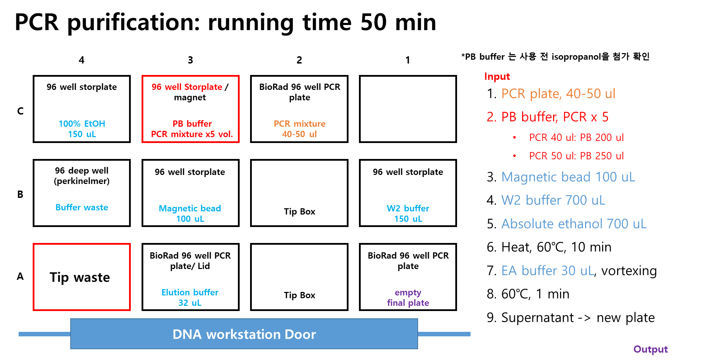
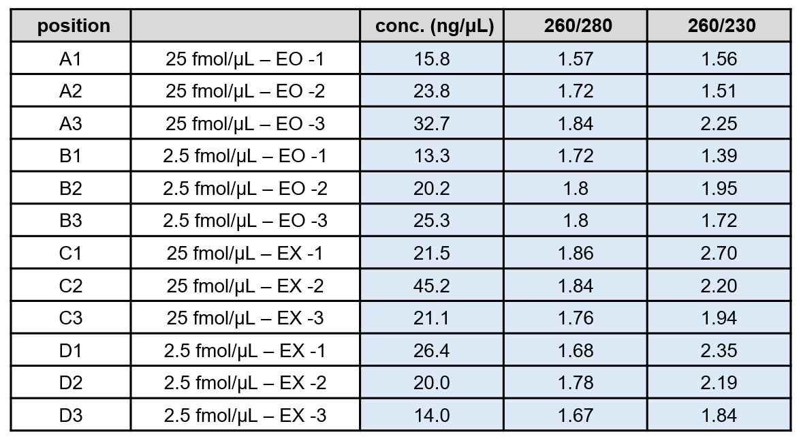

## [WB040 DNA Purification] sfGFP-mCherry assembly product purification
> 본 워크플로는 oligomer assembly 과정에서 생성된 assembly PCR 산물을 불순물 및 비특이적 증폭산물로부터 정제하여 고순도의 targer DNA를 확보하는 절차를 다룬다. 정제된 DNA 는 이후 단계인 Gibson assembly 에 투입 가능한 품질과 농도를 갖추었는지 평가하는 것을 주요 목적으로 한다. 

## 🗂️ Related Unit Operations
- [UHW020 96 Channel Liquid Handling - Automated Purificaiton using Zephyr](#uhw020-96-channel-liquid-handling-automated-purificaiton-using-zephyr)
- [UHW400 Manual - DNA Concentration Measurement using NanoDrop](#uhw400-manual-dna-concentration-measurement-using-nanodrop)
- [UHW230 Nucleic Acid Fragment Analysis - E-gel Electrophoresis of Purified PCR Products](#uhw230-nucleic-acid-fragment-analysis-e-gel-electrophoresis-of-purified-pcr-products)

---

### [UHW020 96 Channel Liquid Handling] Automated Purificaiton using Zephyr

- **Description**: 본 단계에서는 Zyphyr Liquid Handler를 이용하여 sfGFP-mCherry assembly PCR product를 자동으로 정제하였다. 이 과정은 마그네틱 비드 기반의 정제 프로토콜을 자동화하여, 다수의 샘플을 효율적이고 일관되게 처리하는 것을 목표로 한다.

#### Meta
- Experimenter: 윤예린
- Start_date: '2025-11-25'
- End_date: '2025-11-25'
- duration: 1 hr

#### Input
- sfGFP-mCherry assembly PCR products in 96-well plate

#### Reagent
- MagListo™ 5M PCR/Gel Purification Kit (Bioneer, Lot #23031J)
- absolute ethanol (기재 필요)

#### Consumables
- Zypher tip box * 1
- 96-well PCR plate (BioRad) * 2
- 96 well storplate * 4
- 96 deep well plate (PerkinElmer) * 1 (reused)
- Universal Lid * 1

#### Equipment
- Zyphyr Liquid Handler

#### Method
1. Zyphyr 본체, 온도 제어 장치, 연결 PC의 전원을 켠다.

2. 연결된 PC에서 바탕화면의 **`Maestro`(Zyphyr 제어 소프트웨어)** 아이콘을 실행한다.
   - 초기 실행 및 기기 연결에 약간의 시간이 소요될 수 있다.

3. 연결이 완료되는 동안, 아래 사진과 같이 필요한 plate 및 tip을 준비한다.
purification에 필요한 deck layout 은 다음과 같다. 

4. Maestro에서 다음 경로로 purification 프로토콜을 불러온다:
**`[Open Maestro Application] → [Purification] → Purification1_40-50ul`**

   - 본 프로토콜은 40–50 μL PCR product 정제 조건에 최적화되어 있다.

5. 각 plate의 라벨과 실제 배치가 Zyphyr deck layout과 정확히 일치하도록 세팅한다.
    - C3 위치: magnetic plate를 먼저 놓고 그 위에 PB buffer plate를 올린다.
    - Waste plate: 세척 후 재사용 가능하므로 깨끗하고 건조된 plate를 사용한다.
    - **A3 위치의 Elution buffer plate(Lid 표시된 plate)는 Universal Lid로 덮어 준비한다.**
6. 모든 plate가 올바른 방향으로 장착되었는지 기기 정면 및 측면 방향에서 다시 확인한다.
7. Maestro에서 ▶️ Run을 클릭하여 purification 프로세스를 시작한다.
8. 프로세스 중 **Lubrication step(윤활 단계)** 이 자동 포함된다.
    - User Message에 `Place Lubricator at C3!!` 알림이 뜨면 다음을 수행한다:
    • C3 위치의 PB buffer plate와 magnetic plate를 잠시 제거하여 옆에 둔다.
    • Lubricator의 뚜껑을 열고 C3 위치에 배치한다.
        *Lubrication은 팁 이동 시 발생하는 정전기·마찰·마모를 방지하기 위한 과정이다.*
9. 윤활 단계가 끝나면 lubricator를 제거하고, 다시 PB buffer plate와 magnetic plate를 원래대로 C3 위치에 장착한다.
    - 이후 `OK`를 클릭하여 프로세스를 이어간다.

10. `Please enter the number of columns to process` 창이 나타나면, 실제 정제할 sample 수에 맞는 column 수를 입력한다.

11. 이후 Zyphyr는 tip을 pick-up 하면서 프로토콜에 정의된 purification 절차를 자동으로 수행한다.

12. 프로그램이 완료되면 모든 plate를 제거한다.
    - 사용된 tip rack은 폐기한다.
    - waste plate는 세척 후 건조하여 보관한다.

13. 정제된 DNA가 담긴 Elution plate는 즉시 다음 실험 단계에 사용하거나, sealing film으로 밀봉하여 보관한다.

#### Output
- Purified sfGFP-mCherry assembly PCR products in 96-well plate

#### Results & Discussions
- sfGFP-mCherry assembly PCR products를 정제 하였다.
- 정제된 DNA 는 후속 단계에서 NanoDrop 을 이용해 DNA 농도를 측정할 예정이다. 
- 또한 정제효율과 target fragment 확인을 위해 전기영동 분석을 수행할 예정이다.

---

### [UHW400 Manual] DNA Concentration Measurement using NanoDrop

- **Description**: 본 단계에서는 정제된 sfGFP-mCherry assembly PCR product의 DNA 농도(concentration)를 측정하기 위해 NanoDrop spectrophotometer를 사용하였다.
  
#### Meta
- Experimenter: 윤예린
- Start_date: '2025-11-25'
- End_date: '2025-11-25'

#### Input
- Purified DNA samples (96-well PCR plate, 12 samples)

#### Reagent
- Elution buffer (from MagListo™ 5M PCR/Gel Purification Kit)

#### Consumables
- Kimwipes
- Pipette tips (p2.5)

#### Equipment
- NanoDrop 2000c Spectrophotometer (Thermo Fisher Scientific)
- Pipettes (p2.5)

#### Method
1. NanoDrop 전원을 켜고, DNA measurement mode를 선택한다.  
2. Blank 측정을 위해 Elution Buffer 1.5μL를 측정 플랫폼에 떨어뜨리고 [Blank] 버튼을 클릭한다.  
3. 각 시료를 1.5μL씩 측정하여 농도(ng/μL)값을 기록한다.  
4. 각 시료 측정 후 Kimwipe로 렌즈 표면을 닦아 교차오염을 방지한다. 
5. 모든 시료 측정이 완료되면, 데이터를 저장하고 NanoDrop 전원을 끈다.

#### Output
- Purified DNA samples with concentration data (12 samples)
- [251125_NanoDrop_results.xlsx](./resources/Gibson_assembly/251125_insert_concentration.xlsx) 

#### Results & Discussions

- 정제된 sfGFP–mCherry assembly PCR product의 농도는 13–45 ng/μL 범위로 측정되었으며, 이는 downstream Gibson assembly를 수행하기에 충분한 수율을 확보한 수준이다.

- 260/280 비율은 대부분 1.67–1.86로 관찰되었으며, 이는 일반적인 DNA purity 기준(1.8 ± 0.1)에 근접하여 단백질 오염이 크지 않은 상태로 판단된다. 다만 A1 시료(1.57)는 다소 낮아 protein carry-over 가능성이 있다.

- 260/230 비율은 1.39–2.70 범위로 확인되었으며, 일부 시료(B1 = 1.39, A2 = 1.51)는 기준치(1.8–2.2)보다 낮아 salt 또는 buffer 성분 잔류 가능성이 있다.

- 전체적으로 정제 품질은 양호하며, 모든 샘플을 downstream Gibson assembly 단계에 투입하는 데 무리가 없는 수준으로 평가된다.

---

### [UHW230 Nucleic Acid Fragment Analysis] E-gel Electrophoresis of Purified PCR Products

- **Description**: 본 단계에서는 Purified PCR product를 E-gel 전기영동 시스템을 이용하여 분석하였다.

#### Meta
- Experimenter: 윤예린
- Start_date: '2025-11-25'
- End_date: '2025-11-25'
- Duration: 15 minutes

#### Input
- Purified PCR plate (96-well PCR plate, 12 wells used)
  

#### Reagent
- E-Gel 1 Kb DNA Ladder (Invitrogen, Lot #01177830)
- UltraPure™ DNase/RNase-Free Distilled Water (Invitrogen, Lot #2749760)

#### Consumables
- E-gel EX 1 % Agarose (Invitrogen, Lot #T020325-01)
- PCR tubes
- Pipette tips

#### Equipment
- E-Gel Power Snap Electrophoresis Device (Invitrogen)
- E-Gel Power Snap Camera System (Invitrogen)
- Pipette (p2.5, p20)

#### Method
1. E-Gel 1 Kb DNA Ladder 2 μL와 DW 18 μL를 새 PCR tube에 혼합하여 20 μL ladder 시료를 준비한다.  
2. 각 조건의 PCR product 1 μL를 취해, DW 19 μL와 혼합하여 최종 20 μL 시료를 준비한다.  
3. E-Gel EX 1% Agarose cartridge를 E-Gel Electrophoresis System에 장착하고, 전원이 연결되어 있는지 확인한다.  
4. 준비된 DNA ladder 및 각 조건별 sample 20 μL를 E-Gel의 각 well에 순서대로 로딩한다.  
   *만약 well이 비워져 있을 경우, DW 20 μL를 로딩하여 공백을 채운다.*  
5. E-Gel 시스템을 이용하여 1–2% agarose 조건에서 10분간 전기영동을 수행한다.
6. 전기영동이 완료되면, E-Gel viewer 기기를 장착하고 밴드를 확인한다.
7. USB 메모리에 이미지 파일로 저장한다.

#### Output
- E-gel electrophoresis image of purified PCR products

#### Results & Discussions

- 모든 정제된 sfGFP–mCherry assembly PCR product 샘플에서 예상 크기인 약 1.7 kb 부근에 명확한 밴드가 관찰되었다. 이는 정제 과정에서 target fragment가 성공적으로 회수되었음을 시사한다.
- 이전 recovery PCR 후 전기영동 결과와 비교했을때, 정제된 샘플에서 비특이적 밴드와 smear 현상이 현저히 감소한 것을 확인할 수 있었다. 이는 MagListo™ 5M PCR/Gel Purification Kit를 이용한 정제 과정에서 불필요한 side product 제거가 효과적으로 이루어졌음을 의미한다.