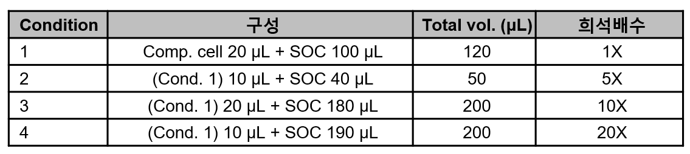
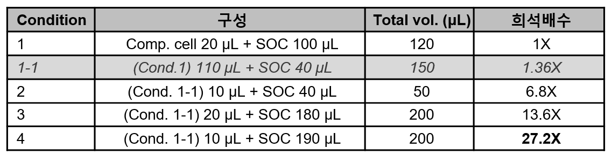
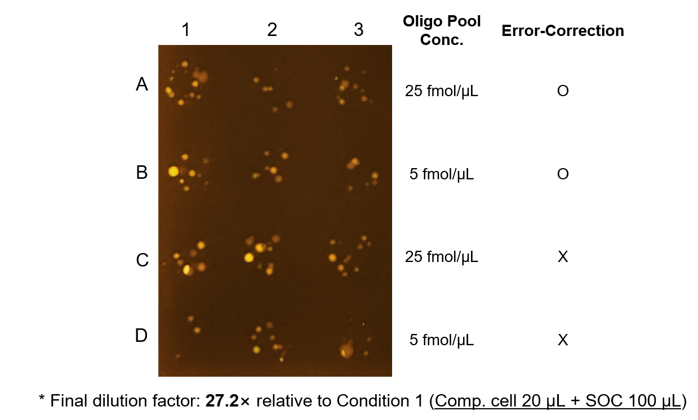

## [WB120 Biology-mediated DNA Transfers] Transformation of Gibson assembly products into E. coli
> 본 워크플로는 Gibson Assembly를 통해 조립된 sfGFP-mCherry 플라스미드를 대장균 세포에 형질전환하는 것을 목표로 한다. 형질전환된 세포는 선택 배지에서 선별 및 배양하여, 성공적인 유전자 도입 여부를 확인한다.

## 🗂️ Related Unit Operations

---

### [UHW020 96 Channel Liquid Handling] Automated Transformation using Zephyr

- **Description**: Zephyr liquid handler를 이용해 ***E. coli* heat shock 기반 형질전환을 자동화된 방식으로 수행하는 절차**를 다룬다. Gibson assembly 반응 산물을 competent cell에 분주한 후, 자동화된 온도 전환 절차를 통해 DNA를 세포 내로 도입한다. 이후 회복 배지(SOC)에서 세포를 회복시키고, 선택 배지에 도말하여 형질전환된 콜로니를 확보하는 과정을 포함한다.

#### Meta
- Experimenter: 윤예린
- Start_date: '2025-11-26'
- End_date: '2025-11-26'

#### Input
- Gibson Assembly reaction mixture (from previous step, 96-well plate, 12 samples)

#### Reagent
- SOC medium 50 mL
- LB + Kanamycin agar plates * 1
- Competent *E. coli* DH5α cells (**20 µL per well**) in Bio-Rad 96-well PCR plate * 1

#### Consumables
- V-bottom single well reservoir (for SOC recovery) * 1
- universal lid for square plates 
- Zephyr Tip Box (96 tips) 
- Ice bucket with ice

#### Equipment
- Zephyr Liquid Handler

#### Method
1. Zephyr 기기 전원, 온도 조절 장치, PC 전원을 켠다.

2. 바탕화면의 Maestro 아이콘을 클릭하여 Zephyr 제어 소프트웨어를 실행한다.

3. 기기와 소프트웨어 연결이 완료되는 동안, Competent cell 이 담긴 96-well plate를 얼음 위에 녹인다.

4. 소프트웨어 연결이 완료되면, 상단의 [Device Control] 아이콘을 클릭하고 Init System 을 클릭하여 기기를 initialize 한다.

5. Initialization이 완료되면, [ThermolLocator1], [ThermolLocator2] 탭으로 이동하여, 각 탭에서 Temp On/Off 버튼을 클릭하여 Turn On 에 체크하여 상태를 True로 변경한다.

6. 이후 Set Temp 버튼을 클릭하여 각각 4°C로 온도를 설정한다.

   - ThermolLocator1: 4°C (B3 위치)
   - ThermolLocator2: 4°C (C2 위치)

7. 실제 온도가 설정온도에 도달하면, 아래 사진과 동일한 구성으로 plates 및 tips 을 Zephyr deck에 장착한다.

    - 모든 plates의 위치가 올바른지 기기 정면과 옆면에서 모두 확인한다.
    - Lid 가 표기된 plate에는 universal lid를 덮어 준비한다.

8. 다음 경로로 프로토콜을 불러온다. `[File] → [Open Application] → [Transformation] → Transformation_yerin`

9. 초록색 ▶️ 버튼을 클릭하여 프로토콜을 시작한다.

10. 첫 번째 단계에서 Lubrication step이 포함되어 있다.
    - User Message에 `"Place Lubricator at C3!!"` 라는 메시지가 뜨면, Zyphyr 기기 C3 위치에 Lubricator 를 뚜껑을 열고 올려놓는다.
    - Lubrication step이 완료되면 lubricator를 제거하고, `OK`버튼을 클릭하여 다음 단계로 진행한다.
11. `"Pleace enter the number of columns to process"` 창이 뜨면, 형질전환할 sample 수에 맞게 column 수를 입력한다.

12. 이후 tip을 가져가면서 프로토콜에 따라 형질전환이 진행된다.

13. 모든 단계가 완료되면, A3 위치에 spotting 된 agar plate를 꺼내어 말린다.

#### Output
- Transformed *E. coli* cells on LB + Kanamycin agar plates

#### Results & Discussions
- Zephyr liquid handler를 이용해 Gibson assembly 산물을 기반으로 한 자동화된 E. coli 형질전환을 수행하였다.

- 형질전환된 세포는 LB + Kanamycin selection 배지에서 배양하여 콜로니 형성 여부 및 transformation 효율을 평가할 예정이다.

- 현재 plating 단계에서 colony density가 높게 나타날 가능성이 있어, colony isolation 및 정확한 colony count 확보를 위해 후속 실험에서 dilution spotting 조건 최적화를 진행할 계획이다.

---

### [UHW020 96 Channel Liquid Handling] Manual Dilution using Zephyr System

- **Description**: 본 단계에서는 Zephyr liquid handler를 이용하여 형질전환된 *E. coli* 세포의 희석(dilution) 작업을 수행한다. 희석된 세포는 이후 도말(spotting) 과정을 통해 콜로니 형성을 평가하는 데 사용된다.

#### Meta
- Experimenter: 윤예린
- Start_date: '2025-11-26'
- End_date: '2025-11-26'

#### Input
- Transformed *E. coli* cells in SOC medium (from previous step, 96-well plate, 12 samples)

#### Reagent
- SOC medium 50 mL

#### Consumables
- 96-well plate (Bio-Rad) * 3
- Zephyr Tip Box (96 tips)
- LB + Kanamycin agar square plate * 3

#### Equipment
- Zephyr Liquid Handler

#### Method

##### Dilution using Zephyr
1. 다음 경로로 프로토콜을 불러온다. `[File] → [Open Application] → [Transformation] → yerin_manual`
2. 이전 단계에서 형질 전환된 *E. coli* 세포가 담긴 96-well plate를 Zephyr deck B3 위치에 장착한다. 
3. SOC medium이 담긴 V-bottom reservoir를 Zephyr deck B4 위치에 장착한다.
4. 희석할 96-well plate를 Zephyr deck C2 위치에 장착한다.
5. Tip box를 Zephyr deck B2, A2 위치에 각각 장착한다.
6. [Divice Control] 아이콘을 클릭하고, [Zephyr] 탭에서 `Load Tips`, `Apirate`, `Dispense`, `Mix`, `Eject Tips` 옵션을 사용하여 희석 작업을 수행한다. 

##### Spotting using Zephyr
7. 희석 작업이 완료되면, 다음 경로로 프로토콜을 불러온다. `[File] → [Open Application] → [Transformation] → yerin_spotting`
8. 희석된 *E. coli* 세포가 담긴 96-well plate를 Zephyr deck B3 위치에 장착한다.
9.  LB + Kanamycin agar square plates를 Lid를 덮은 상태로 Zephyr deck A3 위치에 장칙한다. 
10. 오른쪽 화면의 [Information Window] 창에서 [Method] 탭에서  `Spotting2` 단계를 더블 클릭한다. 
11. 해당 프로토콜의 Load Tips 옵션을 클릭하여 원하는 tip 옵션을 설정한 후, 초록색 ▶️ 버튼을 클릭하여 프로토콜을 시작한다.
12. 프로토콜이 완료되면, 도말된 agar plates를 꺼내어 말린다.

#### Output
- Diluted *E. coli* cells in 96-well plate
- Spotting agar plates with diluted *E. coli* cells

#### Results & Discussions

- Zephyr liquid handler를 이용해 형질전환된 E. coli 세포의 희석 및 도말 작업을 수행하였다.

- 본 실험에서는 원래 최종 20× 희석 조건까지 포함한 1×, 5×, 10×, 20× 조건을 계획하였으나, 실험 과정에서 희석 단계의 혼동으로 인해 아래와 같이 계획과 상이한 희석 조건이 적용되었다. 
    - **계획된 조건** : 1X, 5X, 10X, 20X 희석
        

    - **실제 수행된 조건** : 1X, 6.8X, 13.6X, 27.2X 희석
        

- 희석된 세포는 배양 과정에서 콜로니 형성 여부 및 transformation 성공률을 평가하는 데 활용될 예정이다.

- 또한 도말된 plate의 콜로니 밀도(colony density) 및 분리도(colony isolation quality) 를 평가하여, 이후 실험에서 적절한 희석배수 및 spotting 조건 최적화에 반영할 계획이다. 
  

---

### [UHW400 Manual] Manual Spreading after Transformation 

- **Description**: 본 단계에서는 형질전환된 *E. coli* 세포를 LB + Kanamycin agar plates에 수동으로 도말(spreading)하는 과정을 다룬다. 도말된 세포는 이후 인큐베이터에서 배양하여 콜로니 형성을 유도한다.

#### Meta
- Experimenter: 윤예린
- Start_date: '2025-11-26'
- End_date: '2025-11-26'

#### Input
- Transformed E. coli cells, diluted under **Condition 4** (27.2× dilution relative to base condition)

#### Reagent
- (None)

#### Consumables
- Sterile spreader
- LB + Kanamycin agar plates * 24
- Pipette tips

#### Equipment
- Pipettes
- Clean bench

#### Method
1. Clean bench 내부를 UV 소독 또는 70% EtOH로 정리한 후, 도말 작업을 준비한다.

2. LB + Kanamycin agar plate에 실험 날짜, 샘플 정보, plate 번호 등을 라벨링한다.

3. 각 plate 중앙에 75 µL의 희석된 형질전환 E. coli 세포를 정확히 분주한다.

4. Sterile spreader를 이용하여 세포 현탁액이 agar 표면 전체에 균일하게 확산되도록 부드럽게 도말한다.

5. 도말이 완료되면 plates의 뚜껑을 닫고, 건조를 방지하기 위해 plate를 뒤집어 인큐베이터로 이동한다.

#### Output
- Spread LB + Kanamycin agar plates with transformed E. coli cells

#### Results & Discussions
- 수동 도말 방식을 통해 형질전환된 *E. coli* 세포를 선택 배지에 도말하였다.
- 도말된 plates는 이후 인큐베이터에서 배양하여 콜로니 형성 여부를 평가할 예정이다.

---

### [UHW180 Incubation] Incubation for Colony Formation

- **Description**: 본 단계에서는 형질전환된 *E. coli* 세포가 도말된 LB + Kanamycin agar plates를 인큐베이터에서 배양하여 콜로니 형성을 유도하는 과정을 다룬다. 적절한 온도와 시간 동안 배양함으로써, 형질전환된 세포들이 증식하여 육안으로 확인 가능한 콜로니를 형성할 수 있도록 한다.

#### Meta
- Experimenter: 윤예린
- Start_date: '2025-11-26'
- End_date: '2025-11-27'

#### Input
- Spotted or spread LB + Kanamycin agar plates with transformed *E. coli* cells

#### Reagent
- (None)

#### Consumables
- (None)

#### Equipment
- Incubator set at 37°C

#### Method
1. Spotted or spread LB + Kanamycin agar plates를 인큐베이터에 넣는다.
2. 37°C에서 16~18시간 동안 배양한다.
3. 배양이 완료되면, plates를 인큐베이터에서 꺼내어 콜로니 형성 여부를 확인한다.

#### Output
- Incubated LB + Kanamycin agar plates with formed *E. coli* colonies

#### Results & Discussions
- 형질전환된 *E. coli* 세포는 37°C에서 16시간 배양한 후 plate 상에서 콜로니를 형성하였다.
- Condition 4 (27.2× 희석)에서 도말된 plate에서는 비교적 명확한 단일 콜로니 형성이 관찰되었다.
-  **그러나 전체적인 colony size와 growth rate는 이전 transformation 실험에 비해 눈에 띄게 낮았다.**
상온에서 추가로 24시간 이상 배양한 뒤 plate를 재확인한 결과, 개별 콜로니의 크기는 약간 증가했으나 일반적인 DH5α colony morphology에 비해 여전히 작고 성장 속도가 느린 패턴을 유지하였다.

- 이러한 성장 저해 현상은 이번 실험에서 적용한 Gibson assembly reaction mixture의 상대 농도 증가가 주요 원인으로 판단된다.
**이전 실험에서는 Competent cell 30 µL + Gibson product 2 µL 조성**으로 transformation을 수행하였으나,
**이번 실험에서는 Competent cell 20 µL + Gibson product 2 µL를 사용**하여 Gibson mixture가 전체 반응 부피에서 차지하는 비율이 6.25% → 9.1%로 약 1.5배 증가하였다.

- Gibson reaction mix에는 PEG, high salt, DTT 등 세포 생존성에 영향을 줄 수 있는 성분이 포함되어 있어, 문헌에서도 Gibson product를 과량 사용할 경우 competent cell viability와 plating efficiency가 감소할 수 있음이 보고되어 있다.
따라서 이번 실험에서 관찰된 낮은 colony growth와 작은 colony size는 Gibson mix 독성 증가 + 초기 viable cell 수 감소가 복합적으로 작용한 결과로 해석된다.

- **후속 실험에서는 colony growth 저해 현상을 최소화하고, 단일 콜로니 확보를 위해 Competent cell을 30 µL로 고정하고 Gibson product 투입량을 2 µL로 유지하는 조건으로 형질전환을 재수행하고, colony isolation을 위해서 40 배 희석 spotting 조건을 적용할 예정이다.** 

